# CricketIQ - Enterprise Cricket Intelligence Platform

## Software Architecture Document (SAD) & Product Requirements Document (PRD)

---

## EXECUTIVE SUMMARY

CricketIQ is an enterprise-grade Cricket Intelligence Platform designed to serve millions of users across the global cricket ecosystem. The platform integrates comprehensive data management, real-time scoring, AI-powered analytics, video analysis, and talent scouting into a unified system.

**Vision**: To be the world's most intelligent and comprehensive cricket platform, empowering every level of the cricket ecosystem from grassroots to professional.

**Mission**: To digitize, analyze, and enhance the cricket experience through technology, data, and intelligence.

---

## STEP 1: PRODUCT VISION

### 1.1 Vision Statement

> To be the world's most intelligent and comprehensive cricket platform, empowering every level of the cricket ecosystem from grassroots to professional.

### 1.2 Mission

> To digitize, analyze, and enhance the cricket experience through technology, data, and intelligence. CricketIQ enables organizations to manage their cricket operations efficiently, coaches to make data-driven decisions, players to improve their performance, and fans to engage deeply with the sport.

### 1.3 Product Goals

| Goal | Description | Success Metric |
|------|-------------|----------------|
| **Ecosystem Coverage** | Support all levels of cricket (International, Domestic, Club, Academy, School, Corporate, Women's, Junior) | 95% of top-tier tournaments covered within 2 years |
| **Real-time Scoring** | Enable accurate, real-time ball-by-ball scoring with minimal latency | < 200ms latency for scoring events |
| **AI Insights** | Provide actionable insights to improve performance and strategy | 80% of users engage with AI features weekly |
| **Data Accuracy** | Maintain 99.9% data accuracy for all records | < 0.1% error rate in player statistics |
| **User Engagement** | Achieve high daily active user engagement | 40% DAU/MAU ratio |
| **Platform Scalability** | Support 10 million concurrent users | System handles 10M concurrent users with < 2s response time |

### 1.4 Success Metrics

| Metric | Target (Year 1) | Target (Year 2) | Target (Year 3) |
|--------|-----------------|-----------------|-----------------|
| **Total Users** | 500K | 2M | 10M |
| **Daily Active Users (DAU)** | 50K | 200K | 1M |
| **Monthly Active Users (MAU)** | 200K | 800K | 5M |
| **Tournaments Managed** | 500 | 2,000 | 10,000 |
| **Players Registered** | 100K | 500K | 3M |
| **Matches Scored** | 50K | 200K | 1M |
| **API Requests/Day** | 1M | 10M | 100M |
| **System Uptime** | 99.5% | 99.9% | 99.99% |
| **User Satisfaction (NPS)** | 40 | 60 | 80 |

### 1.5 Target Users

| User Segment | Description | Size Estimate |
|--------------|-------------|---------------|
| **International Cricket Boards** | ICC, BCCI, ECB, CA, PCB, SA Cricket, etc. | 10-20 organizations |
| **Domestic Associations** | State associations, regional bodies | 100-200 organizations |
| **Cricket Clubs** | Local and regional clubs | 10,000+ organizations |
| **Cricket Academies** | Training academies and development programs | 5,000+ organizations |
| **Schools & Universities** | Educational institutions with cricket programs | 10,000+ institutions |
| **Corporate Teams** | Corporate cricket leagues | 500+ organizations |
| **Players** | Registered players across all levels | 1M+ players |
| **Coaches** | Professional and amateur coaches | 100K+ coaches |
| **Umpires & Officials** | Certified match officials | 50K+ officials |
| **Scorers** | Match scorers and data collectors | 100K+ scorers |
| **Parents** | Parents of junior players | 500K+ parents |
| **Spectators** | Fans following cricket | 10M+ users |

### 1.6 User Personas

#### Persona 1: Professional Coach
- **Name**: Alex Sharma
- **Age**: 38
- **Role**: Head Coach, Domestic Team
- **Goals**: Improve team performance, analyze opponent strategies, develop player potential
- **Pain Points**: Limited data availability, difficulty tracking player progress, managing multiple teams
- **Tech Profile**: Tech-savvy, uses multiple digital tools
- **CricketIQ Usage**: Weekly - analyzes match data, reviews training sessions, creates game plans

#### Persona 2: Young Talent
- **Name**: Rohan Patel
- **Age**: 16
- **Role**: Junior Player, Academy Student
- **Goals**: Improve skills, get noticed by selectors, play at higher levels
- **Pain Points**: Lack of performance tracking, limited exposure to scouts, no personalized feedback
- **Tech Profile**: Mobile-first, social media native
- **CricketIQ Usage**: Daily - tracks statistics, watches AI insights, shares achievements

#### Persona 3: Association Administrator
- **Name**: Priya Mehta
- **Age**: 45
- **Role**: Administrator, State Cricket Association
- **Goals**: Streamline operations, manage registrations, generate reports, ensure compliance
- **Pain Points**: Paper-based processes, manual reporting, communication gaps, lack of data visibility
- **Tech Profile**: Desktop-heavy, values efficiency
- **CricketIQ Usage**: Daily - manages registrations, approves events, generates reports

#### Persona 4: Fantasy Player
- **Name**: Vikram Singh
- **Age**: 28
- **Role**: Fantasy Cricket Enthusiast
- **Goals**: Win fantasy leagues, make informed team selections, maximize points
- **Pain Points**: Limited data for predictions, delayed statistics, no advanced analytics
- **Tech Profile**: Mobile-first, data-driven
- **CricketIQ Usage**: Daily during matches - checks real-time stats, uses AI predictions

#### Persona 5: Tournament Organizer
- **Name**: Anil Kumar
- **Age**: 52
- **Role**: Tournament Director, Club Cricket League
- **Goals**: Run efficient tournaments, manage fixtures, coordinate officials, handle registrations
- **Pain Points**: Manual scheduling, communication challenges, scoring coordination
- **Tech Profile**: Medium tech adoption
- **CricketIQ Usage**: Weekly - manages tournaments, coordinates teams, reviews results

#### Persona 6: Media Professional
- **Name**: Sarah Johnson
- **Age**: 35
- **Role**: Sports Journalist
- **Goals**: Report accurate statistics, create engaging content, meet deadlines
- **Pain Points**: Data verification, access to real-time stats, multimedia integration
- **Tech Profile**: Tech-comfortable, values speed and accuracy
- **CricketIQ Usage**: Daily during matches - accesses stats, verifies facts, retrieves media

### 1.7 Business Model

#### Revenue Streams

| Revenue Stream | Description | Pricing Model | Projected Revenue (Y1) |
|----------------|-------------|---------------|------------------------|
| **Subscription (Tiered)** | Different tiers for organizations based on size and features | Per organization/month | $1.2M |
| **Player Premium** | Premium features for individual players (advanced analytics, AI insights) | $4.99/month or $49/year | $2.4M |
| **Tournament Fees** | Fee for managing tournaments above free tier | $50-500 per tournament | $500K |
| **API Access** | RESTful API for third-party integration | $0.01 per 100 requests | $800K |
| **Video Analysis** | Advanced video analysis and tagging | $99-999/month | $600K |
| **Scouting Services** | AI-powered talent scouting and recommendations | $5,000-50,000/year | $1.5M |
| **Sponsorships** | Branding and advertising opportunities | Fixed + performance-based | $2M |
| **Data Licensing** | Aggregated data for media and research | Custom pricing | $1.5M |

#### Pricing Tiers

| Tier | Price | Features | Target |
|------|-------|----------|--------|
| **Free** | $0 | 5 teams, 50 players, 10 tournaments, basic stats | Academies, Clubs |
| **Basic** | $99/month | 20 teams, 200 players, 50 tournaments, advanced stats | Clubs, Schools |
| **Professional** | $299/month | Unlimited teams/players, 200 tournaments, AI insights, video analysis | Associations, Academies |
| **Enterprise** | $999/month | API access, custom integrations, dedicated support, white-label | International Boards |
| **Ultimate** | $2,999/month | All features, multi-tenancy, advanced analytics, custom development | Large Associations |

#### Cost Structure

| Cost Category | Description | Monthly Estimate (Y1) |
|---------------|-------------|----------------------|
| **Engineering** | Development team | $150K |
| **Infrastructure** | Cloud, CDN, storage, databases | $50K |
| **Customer Support** | Support team | $20K |
| **Marketing** | Growth marketing | $30K |
| **Sales** | Sales team | $40K |
| **Legal & Admin** | Legal, HR, admin | $20K |
| **Total** | | **$310K/month** |

#### Unit Economics

| Metric | Y1 | Y2 | Y3 |
|--------|----|----|----|
| **CAC (Customer Acquisition Cost)** | $500 | $400 | $300 |
| **LTV (Lifetime Value)** | $2,500 | $4,000 | $6,000 |
| **LTV:CAC Ratio** | 5.0x | 10x | 20x |
| **Payback Period** | 3 months | 4 months | 5 months |

### 1.8 Revenue Projections

| Year | Revenue Streams | Total Revenue | Profit |
|------|-----------------|---------------|--------|
| **Year 1** | Subscriptions ($1.2M) + Player Premium ($2.4M) + Tournament Fees ($0.5M) + API ($0.8M) + Video ($0.6M) + Scouting ($1.5M) + Sponsorships ($2M) + Data ($1.5M) | **$10.5M** | -$1.6M (Loss) |
| **Year 2** | Subscriptions ($3M) + Player Premium ($6M) + Tournament Fees ($2M) + API ($2M) + Video ($2M) + Scouting ($4M) + Sponsorships ($5M) + Data ($4M) | **$28M** | $6M |
| **Year 3** | Subscriptions ($8M) + Player Premium ($15M) + Tournament Fees ($5M) + API ($5M) + Video ($5M) + Scouting ($10M) + Sponsorships ($10M) + Data ($8M) | **$66M** | $25M |

*Assumptions: 50% gross margin, 30% customer growth month-over-month*

---

## STEP 2: COMPETITOR ANALYSIS

### 2.1 Cricbuzz

| Aspect | Analysis |
|--------|----------|
| **Features** | Live scores, news, articles, statistics, player rankings, fantasy cricket |
| **Strengths** | Strong brand recognition, real-time scores, comprehensive coverage, large user base |
| **Weaknesses** | Limited tournament management, no team/club features, basic analytics, no video analysis, no AI features |
| **Missing Features** | Team management, player tracking, tournament organization, video analysis, AI insights, scouting |
| **UX** | Good for score checking, but lacks depth for team/club management |
| **Technology** | Web and mobile apps, good performance, but outdated architecture |
| **Opportunities** | Deepen engagement through team management, AI insights, video analysis |

### 2.2 CricHeroes

| Aspect | Analysis |
|--------|----------|
| **Features** | Live scores, match schedules, player statistics, fantasy, news |
| **Strengths** | Mobile-first approach, good for fans, comprehensive score coverage |
| **Weaknesses** | Limited organizational features, no team management, no tournament organization, basic analytics |
| **Missing Features** | Club management, academy features, tournament planning, video analysis, AI insights |
| **UX** | Good for score updates, lacks depth for team administrators |
| **Technology** | Mobile apps, decent performance, limited scalability |
| **Opportunities** | Expand to club/league management, add comprehensive features for organizers |

### 2.3 CricClubs

| Aspect | Analysis |
|--------|----------|
| **Features** | Club management, team management, tournament organization, communication |
| **Strengths** | Club-focused, good communication features, decent tournament management |
| **Weaknesses** | Limited analytics, no AI features, basic scoring, limited video integration, limited scalability |
| **Missing Features** | Advanced analytics, AI insights, video analysis, real-time scoring, comprehensive talent scouting |
| **UX** | Functional but dated, lacks modern UI/UX |
| **Technology** | Web-based, decent for small clubs, limited for large organizations |
| **Opportunities** | Modern UI/UX, advanced analytics, AI features, video analysis |

### 2.4 ESPN Cricinfo

| Aspect | Analysis |
|--------|----------|
| **Features** | News, articles, statistics, scorecards, player profiles, records |
| **Strengths** | Authoritative statistics, comprehensive records, excellent content |
| **Weaknesses** | Static content, no real-time features, no team management, no tournament organization |
| **Missing Features** | Real-time scoring, team management, tournament planning, AI insights, video analysis |
| **UX** | Good for reading, lacks interactive features |
| **Technology** | Web-based, good performance, but limited interactivity |
| **Opportunities** | Add real-time features, team management, AI insights |

### 2.5 Hudl

| Aspect | Analysis |
|--------|----------|
| **Features** | Video analysis, breakdown tools, coaching resources, team management |
| **Strengths** | Excellent video analysis, coaching tools, team organization |
| **Weaknesses** | Focus on football, limited cricket-specific features, expensive, complex for small clubs |
| **Missing Features** | Cricket-specific analytics, real-time scoring, comprehensive tournament management |
| **UX** | Powerful but complex, steep learning curve |
| **Technology** | Video-first, good for analysis, limited scoring features |
| **Opportunities** | Cricket-specific video analysis, real-time scoring integration, simplified workflow |

### 2.6 PlayHQ (Australia)

| Aspect | Analysis |
|--------|----------|
| **Features** | Club management, player registration, competition management, scheduling |
| **Strengths** | Comprehensive club management, good for national federations, strong registration system |
| **Weaknesses** | Limited analytics, no AI features, basic video integration, limited international support |
| **Missing Features** | Advanced analytics, AI insights, video analysis, fantasy integration |
| **UX** | Functional but dated, not modern |
| **Technology** | Web-based, good for federation use, limited scalability |
| **Opportunities** | Modern UI/UX, advanced analytics, AI features, video analysis |

### 2.7 TeamSnap

| Aspect | Analysis |
|--------|----------|
| **Features** | Team management, scheduling, communication, payments, registrations |
| **Strengths** | User-friendly, good communication features, payment integration |
| **Weaknesses** | General sports app, limited cricket-specific features, basic analytics |
| **Missing Features** | Cricket-specific analytics, real-time scoring, comprehensive tournament management, AI insights |
| **UX** | Excellent UX, very user-friendly |
| **Technology** | Mobile-first, good performance, but limited cricket depth |
| **Opportunities** | Cricket-specific features, real-time scoring, AI insights |

### 2.8 SportEasy

| Aspect | Analysis |
|--------|----------|
| **Features** | Team management, tournament organization, communication, payments |
| **Strengths** | Multi-sport support, good communication, decent tournament management |
| **Weaknesses** | Limited cricket-specific features, basic analytics, no AI features, limited video integration |
| **Missing Features** | Cricket-specific analytics, real-time scoring, AI insights, video analysis |
| **UX** | Good UX, modern interface |
| **Technology** | Mobile-first, decent performance, limited cricket depth |
| **Opportunities** | Cricket-specific features, real-time scoring, AI insights |

### 2.9 Competitive Analysis Summary

| Competitor | Strengths | Weaknesses | Opportunities for CricketIQ |
|------------|-----------|------------|----------------------------|
| **Cricbuzz** | Brand, real-time scores, large user base | Limited org features, basic analytics | Team management, AI insights, video analysis |
| **CricHeroes** | Mobile-first, score coverage | Limited org features | Club/league management, analytics |
| **CricClubs** | Club-focused, communication | Limited analytics, no AI | Advanced analytics, AI, video |
| **ESPN Cricinfo** | Statistics, content | Static, no real-time | Real-time features, team management |
| **Hudl** | Video analysis, coaching | Football-focused, expensive | Cricket-specific video, real-time scoring |
| **PlayHQ** | Federation management | Limited analytics, dated UX | Modern UI, advanced analytics, AI |
| **TeamSnap** | UX, communication | General sports, basic analytics | Cricket-specific features |
| **SportEasy** | Multi-sport, UX | Limited cricket depth | Cricket-specific features |

### 2.10 Market Opportunities

1. **Comprehensive Cricket-Specific Platform**: No single platform offers all-in-one solution for cricket ecosystem
2. **AI-Driven Insights**: First-mover advantage in cricket analytics with AI
3. **Real-time Scoring**: Opportunity to improve accuracy and ease of live scoring
4. **Video Analysis**: Cricket-specific video analysis is underdeveloped
5. **Talent Scouting**: AI-powered scouting is a unique differentiator
6. **Mobile-First Experience**: Modern UX for all user types
7. **Global Scalability**: Platform can serve cricket globally, not just in traditional markets

---

## STEP 3: DOMAIN ANALYSIS

### 3.1 Domain Identification

#### Core Domain: **Cricket Platform**

The cricket platform is the central nervous system connecting all other domains.

```
Cricket Platform
├── Identity & Access
├── Organization Management
├── Competition Management
├── Venue Management
├── Player Management
├── Team Management
├── Match Management
├── Scoring & Events
├── Analytics & Insights
├── Media & Video
├── Finance & Payments
├── Membership & Registration
├── Notifications & Communication
├── Administration & Audit
├── Security & Compliance
├── Reporting & Dashboards
├── AI & Machine Learning
├── Video Analysis
├── Training Management
├── Medical & Wellness
├── Talent Scouting
└── Integration Layer
```

### 3.2 Domain Breakdown

#### Domain 1: Identity & Access Management

**Purpose**: Manage user identities, authentication, and authorization across the platform.

**Key Entities**:
- User
- Identity Provider
- Role
- Permission
- Session
- Audit Log

**Key Features**:
- Multi-factor authentication
- Single Sign-On (SSO)
- Role-Based Access Control (RBAC)
- Attribute-Based Access Control (ABAC)
- Audit logging
- Passwordless authentication
- Biometric authentication

**External Dependencies**:
- Identity providers (Google, Facebook, Apple)
- SSO providers (Okta, Azure AD)

#### Domain 2: Organization Management

**Purpose**: Manage the hierarchy of cricket organizations from international boards to local clubs.

**Key Entities**:
- Organization
- Organization Type (International, National, Regional, Club, Academy, School, Corporate)
- Organization Hierarchy
- Organization Contact
- Organization Document
- Organization Settings

**Key Features**:
- Organization registration and onboarding
- Organization hierarchy management
- Multi-tenancy support
- Custom branding (white-labeling)
- Organization verification
- Compliance management

**Subdomains**:
- Cricket Board Management
- Association Management
- Club Management
- Academy Management
- School Management
- Corporate Team Management

#### Domain 3: Competition Management

**Purpose**: Manage tournaments, leagues, seasons, and competitions.

**Key Entities**:
- Competition (Tournament, League, Cup)
- Competition Type (International, Domestic, Club, Academy, School, Corporate)
- Season
- Competition Phase (Group Stage, Knockout Stage, Finals)
- Competition Settings
- Competition Document

**Key Features**:
- Tournament creation and configuration
- Season management
- Phase-based tournament structure
- Competition scheduling
- Competition settings and rules
- Tournament documentation

#### Domain 4: Venue Management

**Purpose**: Manage grounds, stadiums, and playing venues.

**Key Entities**:
- Venue
- Venue Type (Stadium, Ground, Practice Facility)
- Venue Address
- Venue Facilities
- Venue Capacity
- Venue Image
- Venue Document

**Key Features**:
- Venue registration and management
- Venue facility management
- Venue availability management
- Venue mapping and directions
- Venue documentation

#### Domain 5: Player Management

**Purpose**: Manage player profiles, performance, and development.

**Key Entities**:
- Player
- Player Profile
- Player Contact
- Player Document
- Player Image
- Player Performance
- Player Stats (Batting, Bowling, Fielding)
- Player Match History
- Player Fitness
- Player Medical Record
- Player Contract
- Player Registration

**Key Features**:
- Player registration and onboarding
- Player profile management
- Player performance tracking
- Player statistics calculation
- Player match history
- Player fitness tracking
- Player medical records
- Player contract management
- Player registration and verification
- Player scouting

**Subdomains**:
- Professional Player Management
- Junior Player Management
- Women's Player Management
- Academy Player Management
- Corporate Player Management

#### Domain 6: Team Management

**Purpose**: Manage teams, squads, and team rosters.

**Key Entities**:
- Team
- Team Type (Senior, Junior, Women's, Academy, Corporate, Development)
- Team Roster
- TeamCaptain
- Team Coach
- Team Staff
- Team Document
- Team Image

**Key Features**:
- Team creation and registration
- Team roster management
- Team captain assignment
- Team coach assignment
- Team documentation
- Team branding

#### Domain 7: Match Management

**Purpose**: Manage match scheduling, preparation, and execution.

**Key Entities**:
- Match
- Match Type (International, Domestic, Club, Academy, School, Corporate, Friendly)
- Match Format (Test, ODI, T20, Hundred, Exhibition)
- Match Status (Scheduled, Live, Completed, Abandoned, Postponed)
- Match Venue
- Match Teams
- Match Officials
- Match Document
- Match Image
- Match Weather

**Key Features**:
- Match scheduling and calendar
- Match venue assignment
- Match team selection
- Match official assignment
- Match document management
- Match weather tracking
- Match cancellation and rescheduling

#### Domain 8: Scoring & Events

**Purpose**: Record ball-by-ball scoring and match events.

**Key Entities**:
- Scoring Session
- Scoring Event (Ball, Wicket, Wide, No Ball, Byes, Leg Byes, Four, Six)
- Scoring Update
- Scoring Notes
- Scoring Video
- Scoring Official
- Scoring Audit Log

**Key Features**:
- Real-time ball-by-ball scoring
- Multiple scoring options (manual, semi-automated, automated)
- Scoring error correction
- Scoring notes and comments
- Scoring video integration
- Scoring official assignment
- Scoring audit trail

#### Domain 9: Analytics & Insights

**Purpose**: Analyze performance and provide actionable insights.

**Key Entities**:
- Analytics Dashboard
- Performance Metric
- Insight
- Comparison
- Trend
- Projection
- Report

**Key Features**:
- Player performance analysis
- Team performance analysis
- Match analysis
- Tournament analysis
- Comparative analysis (player vs player, team vs team)
- Trend analysis
- Projection and forecasting
- Custom analytics
- Export analytics

**Subdomains**:
- Player Analytics
- Team Analytics
- Match Analytics
- Tournament Analytics
- Fantasy Analytics
- Video Analytics

#### Domain 10: Media & Video

**Purpose**: Manage media assets and video content.

**Key Entities**:
- Media Asset
- Media Type (Image, Video, Audio)
- Media Tag
- Media Metadata
- Media Category
- Media License

**Key Features**:
- Media upload and storage
- Media tagging and categorization
- Media search and filtering
- Media thumbnail generation
- Media playback
- Media sharing
- Media rights management

#### Domain 11: Finance & Payments

**Purpose**: Manage financial transactions, memberships, and payments.

**Key Entities**:
- Transaction
- Payment
- Invoice
- Receipt
- Subscription
- Membership
- Fee
- Refund
- Financial Report

**Key Features**:
- Payment processing
- Invoice generation
- Receipt generation
- Subscription management
- Membership management
- Fee collection
- Refund processing
- Financial reporting
- Tax management

#### Domain 12: Membership & Registration

**Purpose**: Manage member registrations and renewals.

**Key Entities**:
- Member
- Member Type (Player, Coach, Umpire, Scorer, Official, Parent, Volunteer)
- Member Registration
- Member Renewal
- Member Document
- Member Verification

**Key Features**:
- Member registration
- Member renewal
- Member verification
- Member documentation
- Membership status management
- Membership fee collection

#### Domain 13: Notifications & Communication

**Purpose**: Send notifications and enable communication.

**Key Entities**:
- Notification
- Notification Template
- Message
- Message Template
- Communication Log
- Subscription Preference

**Key Features**:
- Real-time notifications
- Email notifications
- Push notifications
- SMS notifications
- In-app notifications
- Communication templates
- Communication logs
- Subscription preferences

#### Domain 14: Administration & Audit

**Purpose**: Manage system administration and audit activities.

**Key Entities**:
- Admin Action
- Audit Log
- System Configuration
- Data Export
- Data Import
- System Monitor

**Key Features**:
- System configuration
- User management
- Permission management
- Audit logging
- Data export
- Data import
- System monitoring
- Backup and restore

#### Domain 15: Security & Compliance

**Purpose**: Ensure platform security and compliance with regulations.

**Key Entities**:
- Security Event
- Compliance Check
- Data Protection Officer
- Privacy Policy
- Terms of Service
- Data Processing Agreement

**Key Features**:
- Security monitoring
- Compliance checking
- Data protection
- Privacy management
- Terms management
- Audit trails

#### Domain 16: Reporting & Dashboards

**Purpose**: Generate reports and dashboards for stakeholders.

**Key Entities**:
- Report
- Report Template
- Dashboard
- Dashboard Widget
- Report Schedule
- Report Export

**Key Features**:
- Report generation
- Dashboard creation
- Report scheduling
- Report export
- Dashboard sharing
- Report customization

#### Domain 17: AI & Machine Learning

**Purpose**: Provide AI-powered insights and predictions.

**Key Entities**:
- AI Model
- AI Prediction
- AI Recommendation
- AI Insight
- Training Data
- Model Performance

**Key Features**:
- Performance prediction
- Player recommendations
- Opponent analysis
- Automatic highlights
- Video tagging
- Shot classification
- Bowling analysis
- Field placement suggestions
- Commentary generation
- Chat assistant
- Natural language search

#### Domain 18: Video Analysis

**Purpose**: Analyze match and training videos.

**Key Entities**:
- Video Analysis
- Video Clip
- Video Tag
- Video Annotation
- Analysis Breakdown
- Analysis Report

**Key Features**:
- Video upload and processing
- Video tagging
- Video annotation
- Breakdown tools
- Comparison tools
- Report generation

#### Domain 19: Training Management

**Purpose**: Manage training sessions and player development.

**Key Entities**:
- Training Session
- Training Plan
- Training Drill
- Training Attendance
- Training Performance
- Training Report

**Key Features**:
- Training session scheduling
- Training plan creation
- Training drill management
- Training attendance tracking
- Training performance tracking
- Training reports

#### Domain 20: Medical & Wellness

**Purpose**: Manage player medical records and wellness.

**Key Entities**:
- Medical Record
- Medical Condition
- Medical Test
- Medical Appointment
- Wellness Check
- Injury Report
- Rehabilitation Plan

**Key Features**:
- Medical record management
- Medical condition tracking
- Medical test results
- Medical appointments
- Wellness checks
- Injury reporting
- Rehabilitation tracking

#### Domain 21: Talent Scouting

**Purpose**: Identify and evaluate potential players.

**Key Entities**:
- Scouting Report
- Player Profile (Scouting)
- Scout
- Scouting Criteria
- Scouting Notes
- Scouting Recommendation

**Key Features**:
- Scouting report creation
- Player evaluation
- Scout assignment
- Scouting criteria management
- Scouting notes
- Scouting recommendations

#### Domain 22: Integration Layer

**Purpose**: Enable integration with external systems.

**Key Entities**:
- Integration
- Integration Type (API, Webhook, Database)
- Integration Configuration
- Integration Log
- API Key

**Key Features**:
- RESTful API
- Webhook support
- Database integration
- Third-party integration
- API key management
- Integration monitoring

### 3.3 Domain Relationships

```
┌─────────────────────────────────────────────────────────────────────────────────────┐
│                              Cricket Platform Core                                  │
├─────────────────────────────────────────────────────────────────────────────────────┤
│  Identity ↔ Organization ↔ Competition ↔ Venue ↔ Match ↔ Scoring ↔ Analytics        │
│  Organization ↔ Team ↔ Player ↔ Match ↔ Scoring ↔ Analytics                         │
│  Competition ↔ Match ↔ Scoring ↔ Analytics                                          │
│  Player ↔ Team ↔ Match ↔ Scoring ↔ Analytics                                        │
│  Venue ↔ Match                                                                      │
│  Membership ↔ Organization ↔ Player                                                 │
│  Finance ↔ Membership ↔ Organization                                                │
│  Notifications ↔ All Domains                                                        │
│  Administration ↔ All Domains                                                       │
│  Security ↔ All Domains                                                             │
│  Reporting ↔ All Domains                                                            │
│  AI ↔ Analytics ↔ Scoring ↔ Video                                                   │
│  Video ↔ Scoring ↔ Match                                                            │
│  Training ↔ Player                                                                  │
│  Medical ↔ Player                                                                   │
│  Talent Scouting ↔ Player                                                           │
└─────────────────────────────────────────────────────────────────────────────────────┘
```

### 3.4 Domain Priority Matrix

| Domain | Priority | Reason |
|--------|----------|--------|
| Identity & Access Management | Critical | Foundation for all other domains |
| Organization Management | Critical | Core entity for the platform |
| Player Management | Critical | Central to cricket operations |
| Team Management | Critical | Core entity for cricket |
| Match Management | Critical | Core cricket activity |
| Scoring & Events | Critical | Real-time match data |
| Analytics & Insights | High | Value-added service |
| Competition Management | High | Core cricket activity |
| Venue Management | Medium | Supporting entity |
| Finance & Payments | Medium | Business model enabler |
| Media & Video | Medium | Value-added service |
| Membership & Registration | Medium | Core operation |
| Notifications & Communication | Medium | User engagement |
| Administration & Audit | Medium | Platform management |
| Security & Compliance | Critical | Trust and legal requirements |
| Reporting & Dashboards | High | User value |
| AI & Machine Learning | High | Competitive advantage |
| Video Analysis | Medium | Value-added service |
| Training Management | Medium | Player development |
| Medical & Wellness | High | Player welfare |
| Talent Scouting | High | Long-term value |

### 3.5 Domain Complexity Assessment

| Domain | Complexity | Rationale |
|--------|------------|-----------|
| Identity & Access Management | Medium | Well-established patterns, but critical security implications |
| Organization Management | Medium | Hierarchical structure, multi-tenancy complexity |
| Player Management | High | Complex entity with many related domains |
| Team Management | Medium | Relatively straightforward |
| Match Management | High | Complex scheduling and coordination |
| Scoring & Events | High | Real-time requirements, data accuracy critical |
| Analytics & Insights | High | Data complexity, AI integration |
| Competition Management | High | Complex tournament structures |
| Venue Management | Low | Relatively straightforward |
| Finance & Payments | High | Compliance and security requirements |
| Media & Video | High | Storage and processing complexity |
| Membership & Registration | Medium | Standard registration workflow |
| Notifications & Communication | Medium | Multiple channels, delivery guarantees |
| Administration & Audit | Medium | System management complexity |
| Security & Compliance | High | Critical requirements |
| Reporting & Dashboards | Medium | Data aggregation and presentation |
| AI & Machine Learning | High | Model development and training complexity |
| Video Analysis | High | Video processing complexity |
| Training Management | Low | Relatively straightforward |
| Medical & Wellness | Medium | Sensitive data, compliance requirements |
| Talent Scouting | Medium | Evaluation complexity |

---

## NEXT STEPS

The comprehensive analysis has covered:

1. ✅ Product Vision
2. ✅ Competitor Analysis  
3. ✅ Domain Analysis

I've documented the product vision, mission, goals, success metrics, target users, personas, business model, revenue streams, and a complete domain analysis with 22 domains identified.

**Next sections to complete**:
- Step 4: Bounded Contexts (Domain-Driven Design)
- Step 5: User Roles
- Step 6: Complete Feature Breakdown
- Step 7: Workflow Analysis
- Step 8: Data Model
- Step 9: Architecture
- Step 10: API Design
- Step 11: Frontend Architecture
- Step 12: Security
- Step 13: Performance
- Step 14: AI Features
- Step 15: Roadmap
- Step 16: Final Recommendation

Would you like me to continue with Step 4: Bounded Contexts, or would you prefer to review and provide feedback on the sections completed so far?

<tool_call>
<function=ask_followup_question>
<parameter=question>
## STEP 4: BOUNDED CONTEXTS

Domain-Driven Design (DDD) approach to splitting CricketIQ into bounded contexts.

### 4.1 Bounded Contexts Overview

```
┌─────────────────────────────────────────────────────────────────────────────────────┐
│                           CricketIQ Bounded Contexts                                │
├─────────────────────────────────────────────────────────────────────────────────────┤
│                                                                                     │
│  ┌─────────────────────┐  ┌─────────────────────┐  ┌─────────────────────┐        │
│  │   Identity          │  │   Organization      │  │   Competition       │        │
│  │   Context           │  │   Context           │  │   Context           │        │
│  └─────────────────────┘  └─────────────────────┘  └─────────────────────┘        │
│           │                        │                        │                      │
│           ▼                        ▼                        ▼                      │
│  ┌─────────────────────┐  ┌─────────────────────┐  ┌─────────────────────┐        │
│  │   Player            │  │   Team              │  │   Match             │        │
│  │   Context           │  │   Context           │  │   Context           │        │
│  └─────────────────────┘  └─────────────────────┘  └─────────────────────┘        │
│           │                        │                        │                      │
│           ▼                        ▼                        ▼                      │
│  ┌─────────────────────┐  ┌─────────────────────┐  ┌─────────────────────┐        │
│  │   Scoring           │  │   Analytics         │  │   Media             │        │
│  │   Context           │  │   Context           │  │   Context           │        │
│  └─────────────────────┘  └─────────────────────┘  └─────────────────────┘        │
│           │                        │                        │                      │
│           ▼                        ▼                        ▼                      │
│  ┌─────────────────────┐  ┌─────────────────────┐  ┌─────────────────────┐        │
│  │   Finance           │  │   Membership        │  │   Notification      │        │
│  │   Context           │  │   Context           │  │   Context           │        │
│  └─────────────────────┘  └─────────────────────┘  └─────────────────────┘        │
│           │                        │                        │                      │
│           ▼                        ▼                        ▼                      │
│  ┌─────────────────────┐  ┌─────────────────────┐  ┌─────────────────────┐        │
│  │   Reporting         │  │   AI/ML             │  │   Security          │        │
│  │   Context           │  │   Context           │  │   Context           │        │
│  └─────────────────────┘  └─────────────────────┘  └─────────────────────┘        │
│           │                        │                        │                      │
│           ▼                        ▼                        ▼                      │
│  ┌─────────────────────┐  ┌─────────────────────┐                                 │
│  │   Video Analysis    │  │   Training          │                                 │
│  │   Context           │  │   Context           │                                 │
│  └─────────────────────┘  └─────────────────────┘                                 │
│                                                                                     │
└─────────────────────────────────────────────────────────────────────────────────────┘
```

### 4.2 Bounded Context Definitions

#### Context 1: Identity Context

**Responsibilities**:
- User authentication and authorization
- Role and permission management
- Session management
- Audit logging
- Multi-factor authentication
- Single Sign-On (SSO) integration

**Ownership**: Platform Team

**Relationships**:
- **Consumes**: All contexts (authentication required for all operations)
- **Provides**: User identity, roles, permissions, sessions

**Dependencies**:
- External Identity Providers (Google, Facebook, Apple)
- SSO Providers (Okta, Azure AD)

**Events**:
- `UserRegistered`
- `UserAuthenticated`
- `UserUpdated`
- `UserDeleted`
- `RoleAssigned`
- `PermissionGranted`
- `SessionCreated`
- `SessionExpired`
- `AuthenticationFailed`

**Commands**:
- `RegisterUser`
- `AuthenticateUser`
- `UpdateUser`
- `DeleteUser`
- `AssignRole`
- `RevokeRole`
- `CreateSession`
- `InvalidateSession`

**Aggregates**:
- User (Root)
- Role
- Permission
- Session
- AuditLog

**Value Objects**:
- Email
- PasswordHash
- PhoneNumber
- Address
- AuditRecord

**Entities**:
- User
- Role
- Permission
- Session
- AuditLog

---

#### Context 2: Organization Context

**Responsibilities**:
- Organization registration and management
- Organization hierarchy management
- Multi-tenancy support
- Organization verification
- Custom branding (white-labeling)
- Organization document management

**Ownership**: Platform Team

**Relationships**:
- **Consumes**: Identity Context (authentication)
- **Provides**: Organizations, organization hierarchy
- **Provides to**: All other contexts (organizations reference this context)

**Dependencies**:
- Identity Context (authentication)
- File Storage (organization documents)

**Events**:
- `OrganizationCreated`
- `OrganizationUpdated`
- `OrganizationVerified`
- `OrganizationDeleted`
- `OrganizationHierarchyChanged`
- `OrganizationSettingsUpdated`
- `WhiteLabelSettingsUpdated`

**Commands**:
- `CreateOrganization`
- `UpdateOrganization`
- `VerifyOrganization`
- `DeleteOrganization`
- `UpdateOrganizationHierarchy`
- `UpdateOrganizationSettings`
- `UpdateWhiteLabelSettings`

**Aggregates**:
- Organization (Root)
- OrganizationHierarchy
- OrganizationSettings
- WhiteLabelSettings

**Value Objects**:
- OrganizationName
- OrganizationType
- OrganizationContact
- Address
- ContactInformation
- BrandingConfiguration

**Entities**:
- Organization
- OrganizationHierarchy
- OrganizationContact
- OrganizationSettings
- WhiteLabelSettings

---

#### Context 3: Competition Context

**Responsibilities**:
- Competition (tournament, league, cup) management
- Season management
- Competition phase management
- Competition scheduling
- Competition settings and rules
- Competition documentation

**Ownership**: Competition Team

**Relationships**:
- **Consumes**: Organization Context (organization ownership)
- **Consumes**: Venue Context (match venues)
- **Consumes**: Team Context (competing teams)
- **Consumes**: Match Context (matches within competition)
- **Provides**: Competitions, seasons, phases

**Dependencies**:
- Organization Context (for organization ownership)
- Venue Context (for venue assignment)
- Team Context (for team participation)
- Match Context (for match scheduling)

**Events**:
- `CompetitionCreated`
- `CompetitionUpdated`
- `CompetitionStarted`
- `CompetitionEnded`
- `CompetitionCancelled`
- `SeasonCreated`
- `SeasonUpdated`
- `SeasonStarted`
- `SeasonEnded`
- `PhaseCreated`
- `PhaseUpdated`
- `PhaseStarted`
- `PhaseEnded`

**Commands**:
- `CreateCompetition`
- `UpdateCompetition`
- `StartCompetition`
- `EndCompetition`
- `CancelCompetition`
- `CreateSeason`
- `UpdateSeason`
- `StartSeason`
- `EndSeason`
- `CreatePhase`
- `UpdatePhase`
- `StartPhase`
- `EndPhase`

**Aggregates**:
- Competition (Root)
- Season
- CompetitionPhase
- CompetitionSettings
- CompetitionDocument

**Value Objects**:
- CompetitionName
- CompetitionType
- CompetitionFormat
- PhaseName
- PhaseType
- CompetitionRule

**Entities**:
- Competition
- Season
- CompetitionPhase
- CompetitionSettings
- CompetitionDocument

---

#### Context 4: Venue Context

**Responsibilities**:
- Venue registration and management
- Venue facility management
- Venue availability management
- Venue mapping and directions
- Venue documentation

**Ownership**: Venue Team

**Relationships**:
- **Consumes**: Organization Context (organization ownership)
- **Consumes**: Competition Context (competition venues)
- **Consumes**: Match Context (match venues)
- **Provides**: Venues, venue availability

**Dependencies**:
- Organization Context (for organization ownership)
- Map Services (for directions)

**Events**:
- `VenueCreated`
- `VenueUpdated`
- `VenueDeleted`
- `VenueAvailabilityChanged`
- `VenueFacilityAdded`
- `VenueFacilityRemoved`
- `VenueCapacityUpdated`

**Commands**:
- `CreateVenue`
- `UpdateVenue`
- `DeleteVenue`
- `UpdateVenueAvailability`
- `AddVenueFacility`
- `RemoveVenueFacility`
- `UpdateVenueCapacity`

**Aggregates**:
- Venue (Root)
- VenueFacility
- VenueAvailability
- VenueDocument

**Value Objects**:
- VenueName
- VenueType
- Address
- Coordinates
- ContactInformation
- FacilityName
- FacilityDescription
- Capacity

**Entities**:
- Venue
- VenueFacility
- VenueAvailability
- VenueDocument

---

#### Context 5: Player Context

**Responsibilities**:
- Player registration and onboarding
- Player profile management
- Player performance tracking
- Player statistics calculation
- Player match history
- Player fitness tracking
- Player medical records
- Player contract management
- Player registration and verification
- Player scouting

**Ownership**: Player Team

**Relationships**:
- **Consumes**: Identity Context (user account)
- **Consumes**: Organization Context (organization membership)
- **Consumes**: Team Context (team membership)
- **Consumes**: Match Context (match participation)
- **Consumes**: Scoring Context (performance data)
- **Consumes**: Medical Context (medical records)
- **Consumes**: Talent Context (scouting data)
- **Provides**: Players, player profiles, player statistics

**Dependencies**:
- Identity Context (for user account)
- Organization Context (for organization membership)
- Team Context (for team membership)
- Match Context (for match participation)
- Scoring Context (for performance data)
- Medical Context (for medical records)
- Talent Context (for scouting data)

**Events**:
- `PlayerRegistered`
- `PlayerProfileUpdated`
- `PlayerVerified`
- `PlayerDeleted`
- `PlayerStatsUpdated`
- `PlayerFitnessUpdated`
- `PlayerMedicalRecordUpdated`
- `PlayerContractUpdated`
- `PlayerScoutingReportAdded`

**Commands**:
- `RegisterPlayer`
- `UpdatePlayerProfile`
- `VerifyPlayer`
- `DeletePlayer`
- `UpdatePlayerStats`
- `UpdatePlayerFitness`
- `UpdatePlayerMedicalRecord`
- `UpdatePlayerContract`
- `AddScoutingReport`

**Aggregates**:
- Player (Root)
- PlayerProfile
- PlayerStats
- PlayerFitness
- PlayerMedicalRecord
- PlayerContract
- PlayerRegistration

**Value Objects**:
- PlayerName
- PlayerContact
- PlayerDocument
- PlayerImage
- PlayerPerformance
- PlayerStatistics
- FitnessMetrics
- MedicalCondition
- ContractDetails
- RegistrationDetails

**Entities**:
- Player
- PlayerProfile
- PlayerStats
- PlayerFitness
- PlayerMedicalRecord
- PlayerContract
- PlayerRegistration

---

#### Context 6: Team Context

**Responsibilities**:
- Team creation and registration
- Team roster management
- Team captain assignment
- Team coach assignment
- Team documentation
- Team branding

**Ownership**: Team Team

**Relationships**:
- **Consumes**: Organization Context (organization ownership)
- **Consumes**: Player Context (team members)
- **Consumes**: Competition Context (team participation)
- **Consumes**: Match Context (team matches)
- **Provides**: Teams, team rosters

**Dependencies**:
- Organization Context (for organization ownership)
- Player Context (for team members)
- Competition Context (for team participation)
- Match Context (for team matches)

**Events**:
- `TeamCreated`
- `TeamUpdated`
- `TeamDeleted`
- `TeamRosterUpdated`
- `TeamCaptainAssigned`
- `TeamCoachAssigned`
- `TeamJoinedCompetition`
- `TeamLeftCompetition`
- `TeamBrandingUpdated`

**Commands**:
- `CreateTeam`
- `UpdateTeam`
- `DeleteTeam`
- `UpdateTeamRoster`
- `AssignTeamCaptain`
- `AssignTeamCoach`
- `JoinCompetition`
- `LeaveCompetition`
- `UpdateTeamBranding`

**Aggregates**:
- Team (Root)
- TeamRoster
- TeamCaptain
- TeamCoach
- TeamDocument
- TeamBranding

**Value Objects**:
- TeamName
- TeamType
- TeamCode
- TeamLogo
- TeamColors
- TeamContact

**Entities**:
- Team
- TeamRoster
- TeamCaptain
- TeamCoach
- TeamDocument
- TeamBranding

---

#### Context 7: Match Context

**Responsibilities**:
- Match scheduling and calendar
- Match venue assignment
- Match team selection
- Match official assignment
- Match document management
- Match weather tracking
- Match cancellation and rescheduling

**Ownership**: Match Team

**Relationships**:
- **Consumes**: Organization Context (organization ownership)
- **Consumes**: Competition Context (competition ownership)
- **Consumes**: Venue Context (match venue)
- **Consumes**: Team Context (participating teams)
- **Consumes**: Player Context (participating players)
- **Consumes**: Scoring Context (match scoring)
- **Consumes**: Analytics Context (match analytics)
- **Provides**: Matches, match schedules

**Dependencies**:
- Organization Context (for organization ownership)
- Competition Context (for competition ownership)
- Venue Context (for venue assignment)
- Team Context (for team participation)
- Player Context (for player participation)
- Scoring Context (for match scoring)
- Analytics Context (for match analytics)

**Events**:
- `MatchScheduled`
- `MatchUpdated`
- `MatchCancelled`
- `MatchRescheduled`
- `MatchStarted`
- `MatchEnded`
- `MatchAbandoned`
- `MatchVenueAssigned`
- `MatchTeamsSelected`
- `MatchOfficialsAssigned`
- `MatchWeatherUpdated`

**Commands**:
- `ScheduleMatch`
- `UpdateMatch`
- `CancelMatch`
- `RescheduleMatch`
- `StartMatch`
- `EndMatch`
- `AbandonMatch`
- `AssignVenue`
- `SelectTeams`
- `AssignOfficials`
- `UpdateWeather`

**Aggregates**:
- Match (Root)
- MatchSchedule
- MatchVenue
- MatchTeams
- MatchOfficials
- MatchDocument
- MatchWeather

**Value Objects**:
- MatchName
- MatchType
- MatchFormat
- MatchStatus
- ScheduledTime
- VenueDetails
- TeamDetails
- OfficialDetails
- WeatherCondition

**Entities**:
- Match
- MatchSchedule
- MatchVenue
- MatchTeams
- MatchOfficials
- MatchDocument
- MatchWeather

---

#### Context 8: Scoring Context

**Responsibilities**:
- Real-time ball-by-ball scoring
- Multiple scoring options (manual, semi-automated, automated)
- Scoring error correction
- Scoring notes and comments
- Scoring video integration
- Scoring official assignment
- Scoring audit trail

**Ownership**: Scoring Team

**Relationships**:
- **Consumes**: Match Context (match scoring)
- **Consumes**: Player Context (player performance)
- **Consumes**: Team Context (team performance)
- **Consumes**: Analytics Context (performance analytics)
- **Consumes**: Media Context (scoring video)
- **Provides**: Scoring sessions, scoring events, scoring updates

**Dependencies**:
- Match Context (for match identification)
- Player Context (for player performance)
- Team Context (for team performance)
- Analytics Context (for performance analytics)
- Media Context (for scoring video)

**Events**:
- `ScoringSessionStarted`
- `ScoringSessionUpdated`
- `ScoringSessionEnded`
- `ScoringEventRecorded`
- `ScoringEventUpdated`
- `ScoringEventCancelled`
- `ScoringNotesAdded`
- `ScoringVideoAttached`
- `ScoringOfficialAssigned`

**Commands**:
- `StartScoringSession`
- `UpdateScoringSession`
- `EndScoringSession`
- `RecordScoringEvent`
- `UpdateScoringEvent`
- `CancelScoringEvent`
- `AddScoringNotes`
- `AttachScoringVideo`
- `AssignScoringOfficial`

**Aggregates**:
- ScoringSession (Root)
- ScoringEvent
- ScoringNotes
- ScoringVideo
- ScoringOfficial

**Value Objects**:
- SessionStatus
- EventStatus
- EventDetails
- EventResult
- EventComment
- EventAuditRecord

**Entities**:
- ScoringSession
- ScoringEvent
- ScoringNotes
- ScoringVideo
- ScoringOfficial

---

#### Context 9: Analytics Context

**Responsibilities**:
- Player performance analysis
- Team performance analysis
- Match analysis
- Tournament analysis
- Comparative analysis
- Trend analysis
- Projection and forecasting
- Custom analytics
- Export analytics

**Ownership**: Analytics Team

**Relationships**:
- **Consumes**: Scoring Context (performance data)
- **Consumes**: Match Context (match data)
- **Consumes**: Team Context (team data)
- **Consumes**: Player Context (player data)
- **Consumes**: Competition Context (tournament data)
- **Consumes**: Media Context (video data)
- **Consumes**: AI Context (AI insights)
- **Provides**: Analytics dashboards, performance metrics, insights

**Dependencies**:
- Scoring Context (for performance data)
- Match Context (for match data)
- Team Context (for team data)
- Player Context (for player data)
- Competition Context (for tournament data)
- Media Context (for video data)
- AI Context (for AI insights)

**Events**:
- `AnalyticsGenerated`
- `AnalyticsUpdated`
- `AnalyticsExported`
- `InsightGenerated`
- `ComparisonGenerated`
- `TrendDetected`
- `ProjectionUpdated`

**Commands**:
- `GenerateAnalytics`
- `UpdateAnalytics`
- `ExportAnalytics`
- `GenerateInsight`
- `GenerateComparison`
- `DetectTrend`
- `UpdateProjection`

**Aggregates**:
- AnalyticsDashboard (Root)
- PerformanceMetric
- Insight
- Comparison
- Trend
- Projection
- Report

**Value Objects**:
- DashboardConfig
- MetricName
- MetricValue
- InsightType
- ComparisonType
- TrendType
- ProjectionConfig
- ReportFormat

**Entities**:
- AnalyticsDashboard
- PerformanceMetric
- Insight
- Comparison
- Trend
- Projection
- Report

---

#### Context 10: Media Context

**Responsibilities**:
- Media upload and storage
- Media tagging and categorization
- Media search and filtering
- Media thumbnail generation
- Media playback
- Media sharing
- Media rights management

**Ownership**: Media Team

**Relationships**:
- **Consumes**: Match Context (match media)
- **Consumes**: Player Context (player media)
- **Consumes**: Team Context (team media)
- **Consumes**: Competition Context (tournament media)
- **Consumes**: Video Analysis Context (video analysis)
- **Provides**: Media assets, media search

**Dependencies**:
- Match Context (for match media)
- Player Context (for player media)
- Team Context (for team media)
- Competition Context (for tournament media)
- Video Analysis Context (for video analysis)
- Object Storage (for media storage)

**Events**:
- `MediaUploaded`
- `MediaUpdated`
- `MediaDeleted`
- `MediaTagged`
- `MediaCategorized`
- `MediaThumbnailGenerated`
- `MediaShared`
- `MediaRightsUpdated`

**Commands**:
- `UploadMedia`
- `UpdateMedia`
- `DeleteMedia`
- `TagMedia`
- `CategorizeMedia`
- `GenerateThumbnail`
- `ShareMedia`
- `UpdateMediaRights`

**Aggregates**:
- MediaAsset (Root)
- MediaTag
- MediaCategory
- MediaMetadata
- MediaLicense

**Value Objects**:
- MediaName
- MediaType
- MediaUrl
- MediaSize
- MediaFormat
- MediaDescription
- MediaRights

**Entities**:
- MediaAsset
- MediaTag
- MediaCategory
- MediaMetadata
- MediaLicense

---

#### Context 11: Finance Context

**Responsibilities**:
- Payment processing
- Invoice generation
- Receipt generation
- Subscription management
- Membership management
- Fee collection
- Refund processing
- Financial reporting
- Tax management

**Ownership**: Finance Team

**Relationships**:
- **Consumes**: Organization Context (organization billing)
- **Consumes**: Membership Context (member billing)
- **Consumes**: Player Context (player billing)
- **Consumes**: Competition Context (tournament fees)
- **Provides**: Transactions, payments, invoices

**Dependencies**:
- Organization Context (for organization billing)
- Membership Context (for member billing)
- Player Context (for player billing)
- Competition Context (for tournament fees)
- Payment Gateway (for payment processing)

**Events**:
- `PaymentProcessed`
- `PaymentFailed`
- `RefundProcessed`
- `InvoiceGenerated`
- `ReceiptGenerated`
- `SubscriptionCreated`
- `SubscriptionUpdated`
- `SubscriptionCancelled`
- `MembershipCreated`
- `MembershipUpdated`
- `MembershipCancelled`
- `FeeCollected`
- `FinancialReportGenerated`

**Commands**:
- `ProcessPayment`
- `ProcessRefund`
- `GenerateInvoice`
- `GenerateReceipt`
- `CreateSubscription`
- `UpdateSubscription`
- `CancelSubscription`
- `CreateMembership`
- `UpdateMembership`
- `CancelMembership`
- `CollectFee`
- `GenerateFinancialReport`

**Aggregates**:
- Transaction (Root)
- Payment
- Invoice
- Receipt
- Subscription
- Membership
- Fee
- Refund
- FinancialReport

**Value Objects**:
- TransactionId
- PaymentStatus
- InvoiceStatus
- ReceiptStatus
- SubscriptionDetails
- MembershipDetails
- FeeAmount
- RefundDetails
- FinancialReportData

**Entities**:
- Transaction
- Payment
- Invoice
- Receipt
- Subscription
- Membership
- Fee
- Refund
- FinancialReport

---

#### Context 12: Membership Context

**Responsibilities**:
- Member registration
- Member renewal
- Member verification
- Member documentation
- Membership status management
- Membership fee collection

**Ownership**: Membership Team

**Relationships**:
- **Consumes**: Identity Context (user account)
- **Consumes**: Organization Context (organization membership)
- **Consumes**: Finance Context (membership fees)
- **Provides**: Members, membership status

**Dependencies**:
- Identity Context (for user account)
- Organization Context (for organization membership)
- Finance Context (for membership fees)

**Events**:
- `MemberRegistered`
- `MemberUpdated`
- `MemberVerified`
- `MemberDeleted`
- `MemberRenewed`
- `MemberCancelled`
- `MembershipStatusChanged`
- `MembershipFeeCollected`

**Commands**:
- `RegisterMember`
- `UpdateMember`
- `VerifyMember`
- `DeleteMember`
- `RenewMember`
- `CancelMember`
- `ChangeMembershipStatus`
- `CollectMembershipFee`

**Aggregates**:
- Member (Root)
- MemberRegistration
- MemberDocumentation
- MembershipStatus
- MembershipFee

**Value Objects**:
- MemberName
- MemberType
- MemberContact
- MemberDocument
- MembershipStatus
- FeeAmount

**Entities**:
- Member
- MemberRegistration
- MemberDocumentation
- MembershipStatus
- MembershipFee

---

#### Context 13: Notification Context

**Responsibilities**:
- Real-time notifications
- Email notifications
- Push notifications
- SMS notifications
- In-app notifications
- Communication templates
- Communication logs
- Subscription preferences

**Ownership**: Platform Team

**Relationships**:
- **Consumes**: All contexts (notifications for all operations)
- **Provides**: Notifications, communication logs

**Dependencies**:
- All contexts (for notification triggers)
- Email Service (for email notifications)
- Push Notification Service (for push notifications)
- SMS Service (for SMS notifications)

**Events**:
- `NotificationSent`
- `NotificationDelivered`
- `NotificationRead`
- `NotificationFailed`
- `EmailSent`
- `EmailDelivered`
- `EmailFailed`
- `PushSent`
- `PushDelivered`
- `PushFailed`
- `SMSSent`
- `SMSDelivered`
- `SMSFailed`

**Commands**:
- `SendNotification`
- `SendEmail`
- `SendPush`
- `SendSMS`
- `LogCommunication`
- `UpdatePreferences`

**Aggregates**:
- Notification (Root)
- NotificationTemplate
- CommunicationLog
- SubscriptionPreference

**Value Objects**:
- NotificationType
- NotificationContent
- NotificationStatus
- TemplateName
- TemplateContent
- CommunicationType
- CommunicationContent
- PreferenceType
- PreferenceValue

**Entities**:
- Notification
- NotificationTemplate
- CommunicationLog
- SubscriptionPreference

---

#### Context 14: Reporting Context

**Responsibilities**:
- Report generation
- Dashboard creation
- Report scheduling
- Report export
- Dashboard sharing
- Report customization

**Ownership**: Analytics Team

**Relationships**:
- **Consumes**: Analytics Context (analytics data)
- **Consumes**: Organization Context (organization reports)
- **Consumes**: Competition Context (tournament reports)
- **Consumes**: Player Context (player reports)
- **Consumes**: Team Context (team reports)
- **Provides**: Reports, dashboards

**Dependencies**:
- Analytics Context (for analytics data)
- Organization Context (for organization reports)
- Competition Context (for tournament reports)
- Player Context (for player reports)
- Team Context (for team reports)

**Events**:
- `ReportGenerated`
- `ReportUpdated`
- `ReportExported`
- `DashboardCreated`
- `DashboardUpdated`
- `DashboardShared`
- `ReportScheduled`
- `ReportDelivered`

**Commands**:
- `GenerateReport`
- `UpdateReport`
- `ExportReport`
- `CreateDashboard`
- `UpdateDashboard`
- `ShareDashboard`
- `ScheduleReport`
- `DeliverReport`

**Aggregates**:
- Report (Root)
- ReportTemplate
- Dashboard
- DashboardWidget
- ReportSchedule
- ReportExport

**Value Objects**:
- ReportName
- ReportType
- ReportFormat
- TemplateName
- TemplateContent
- WidgetConfig
- ScheduleConfig
- ExportFormat

**Entities**:
- Report
- ReportTemplate
- Dashboard
- DashboardWidget
- ReportSchedule
- ReportExport

---

#### Context 15: AI/ML Context

**Responsibilities**:
- Performance prediction
- Player recommendations
- Opponent analysis
- Automatic highlights
- Video tagging
- Shot classification
- Bowling analysis
- Field placement suggestions
- Commentary generation
- Chat assistant
- Natural language search

**Ownership**: AI/ML Team

**Relationships**:
- **Consumes**: Analytics Context (data for models)
- **Consumes**: Media Context (video for analysis)
- **Consumes**: Player Context (player data)
- **Consumes**: Match Context (match data)
- **Consumes**: Competition Context (tournament data)
- **Provides**: AI predictions, AI recommendations, AI insights

**Dependencies**:
- Analytics Context (for data)
- Media Context (for video)
- Player Context (for player data)
- Match Context (for match data)
- Competition Context (for tournament data)
- ML Framework (for model training)
- Vector Database (for similarity search)

**Events**:
- `PredictionGenerated`
- `RecommendationGenerated`
- `InsightGenerated`
- `HighlightGenerated`
- `VideoTagged`
- `ShotClassified`
- `AnalysisGenerated`
- `CommentaryGenerated`
- `QuestionAnswered`
- `SearchCompleted`

**Commands**:
- `GeneratePrediction`
- `GenerateRecommendation`
- `GenerateInsight`
- `GenerateHighlight`
- `TagVideo`
- `ClassifyShot`
- `GenerateAnalysis`
- `GenerateCommentary`
- `AnswerQuestion`
- `PerformSearch`

**Aggregates**:
- AIModel (Root)
- AIPrediction
- AIRecommendation
- AIInsight
- AIHighlight
- AIVideoTag
- AIShotClassification
- AIAnalysis
- AICommentary
- AIChatResponse
- AISearchResult

**Value Objects**:
- ModelName
- ModelVersion
- PredictionType
- PredictionResult
- RecommendationType
- RecommendationDetails
- InsightType
- InsightDetails
- HighlightType
- HighlightDetails
- TagType
- TagDetails
- ClassificationType
- ClassificationDetails
- AnalysisType
- AnalysisDetails
- CommentaryType
- CommentaryDetails
- QuestionType
- AnswerDetails
- SearchQuery
- SearchResult

**Entities**:
- AIModel
- AIPrediction
- AIRecommendation
- AIInsight
- AIHighlight
- AIVideoTag
- AIShotClassification
- AIAnalysis
- AICommentary
- AIChatResponse
- AISearchResult

---

#### Context 16: Video Analysis Context

**Responsibilities**:
- Video upload and processing
- Video tagging
- Video annotation
- Breakdown tools
- Comparison tools
- Report generation

**Ownership**: Media Team

**Relationships**:
- **Consumes**: Match Context (match videos)
- **Consumes**: Player Context (player videos)
- **Consumes**: Team Context (team videos)
- **Consumes**: Media Context (video storage)
- **Consumes**: AI Context (video analysis)
- **Provides**: Video analysis, video breakdowns

**Dependencies**:
- Match Context (for match videos)
- Player Context (for player videos)
- Team Context (for team videos)
- Media Context (for video storage)
- AI Context (for video analysis)
- Video Processing Service (for video processing)

**Events**:
- `VideoUploaded`
- `VideoProcessed`
- `VideoTagged`
- `VideoAnnotated`
- `AnalysisGenerated`
- `BreakdownGenerated`
- `ComparisonGenerated`
- `ReportGenerated`

**Commands**:
- `UploadVideo`
- `ProcessVideo`
- `TagVideo`
- `AnnotateVideo`
- `GenerateAnalysis`
- `GenerateBreakdown`
- `GenerateComparison`
- `GenerateReport`

**Aggregates**:
- VideoAnalysis (Root)
- VideoClip
- VideoTag
- VideoAnnotation
- AnalysisBreakdown
- AnalysisReport

**Value Objects**:
- VideoName
- VideoType
- VideoUrl
- VideoDuration
- VideoQuality
- TagType
- TagDetails
- AnnotationType
- AnnotationDetails
- BreakdownType
- BreakdownDetails
- ReportType
- ReportDetails

**Entities**:
- VideoAnalysis
- VideoClip
- VideoTag
- VideoAnnotation
- AnalysisBreakdown
- AnalysisReport

---

#### Context 17: Training Context

**Responsibilities**:
- Training session scheduling
- Training plan creation
- Training drill management
- Training attendance tracking
- Training performance tracking
- Training reports

**Ownership**: Training Team

**Relationships**:
- **Consumes**: Player Context (player training)
- **Consumes**: Team Context (team training)
- **Consumes**: Coach Context (training plans)
- **Provides**: Training sessions, training plans

**Dependencies**:
- Player Context (for player training)
- Team Context (for team training)
- Coach Context (for training plans)

**Events**:
- `TrainingSessionScheduled`
- `TrainingSessionUpdated`
- `TrainingSessionCancelled`
- `TrainingSessionStarted`
- `TrainingSessionEnded`
- `TrainingPlanCreated`
- `TrainingPlanUpdated`
- `TrainingDrillCreated`
- `TrainingDrillUpdated`
- `AttendanceRecorded`
- `PerformanceRecorded`
- `TrainingReportGenerated`

**Commands**:
- `ScheduleTrainingSession`
- `UpdateTrainingSession`
- `CancelTrainingSession`
- `StartTrainingSession`
- `EndTrainingSession`
- `CreateTrainingPlan`
- `UpdateTrainingPlan`
- `CreateTrainingDrill`
- `UpdateTrainingDrill`
- `RecordAttendance`
- `RecordPerformance`
- `GenerateTrainingReport`

**Aggregates**:
- TrainingSession (Root)
- TrainingPlan
- TrainingDrill
- TrainingAttendance
- TrainingPerformance
- TrainingReport

**Value Objects**:
- SessionName
- SessionType
- SessionDate
- SessionStatus
- PlanName
- PlanType
- DrillName
- DrillType
- DrillDetails
- AttendanceStatus
- PerformanceMetrics
- ReportType
- ReportDetails

**Entities**:
- TrainingSession
- TrainingPlan
- TrainingDrill
- TrainingAttendance
- TrainingPerformance
- TrainingReport

---

#### Context 18: Medical Context

**Responsibilities**:
- Medical record management
- Medical condition tracking
- Medical test results
- Medical appointments
- Wellness checks
- Injury reporting
- Rehabilitation tracking

**Ownership**: Medical Team

**Relationships**:
- **Consumes**: Player Context (player medical records)
- **Consumes**: Coach Context (medical requirements)
- **Consumes**: Player Context (player medical data)
- **Provides**: Medical records, medical reports

**Dependencies**:
- Player Context (for player medical records)
- Coach Context (for medical requirements)

**Events**:
- `MedicalRecordCreated`
- `MedicalRecordUpdated`
- `MedicalRecordDeleted`
- `MedicalConditionAdded`
- `MedicalConditionUpdated`
- `MedicalConditionRemoved`
- `MedicalTestResultAdded`
- `MedicalTestResultUpdated`
- `MedicalAppointmentScheduled`
- `MedicalAppointmentCompleted`
- `InjuryReported`
- `InjuryUpdated`
- `InjuryRecovered`
- `RehabilitationPlanCreated`
- `RehabilitationPlanUpdated`
- `WellnessCheckCompleted`

**Commands**:
- `CreateMedicalRecord`
- `UpdateMedicalRecord`
- `DeleteMedicalRecord`
- `AddMedicalCondition`
- `UpdateMedicalCondition`
- `RemoveMedicalCondition`
- `AddMedicalTestResult`
- `UpdateMedicalTestResult`
- `ScheduleMedicalAppointment`
- `CompleteMedicalAppointment`
- `ReportInjury`
- `UpdateInjury`
- `MarkInjuryRecovered`
- `CreateRehabilitationPlan`
- `UpdateRehabilitationPlan`
- `CompleteWellnessCheck`

**Aggregates**:
- MedicalRecord (Root)
- MedicalCondition
- MedicalTest
- MedicalAppointment
- WellnessCheck
- InjuryReport
- RehabilitationPlan

**Value Objects**:
- RecordId
- ConditionType
- ConditionDetails
- TestType
- TestResult
- AppointmentType
- AppointmentDetails
- CheckType
- CheckResult
- InjuryType
- InjuryDetails
- RecoveryStatus
- PlanType
- PlanDetails
- WellnessMetrics

**Entities**:
- MedicalRecord
- MedicalCondition
- MedicalTest
- MedicalAppointment
- WellnessCheck
- InjuryReport
- RehabilitationPlan

---

#### Context 19: Talent Context

**Responsibilities**:
- Scouting report creation
- Player evaluation
- Scout assignment
- Scouting criteria management
- Scouting notes
- Scouting recommendations

**Ownership**: Talent Team

**Relationships**:
- **Consumes**: Player Context (player profiles)
- **Consumes**: Coach Context (scouting requirements)
- **Consumes**: Organization Context (organization needs)
- **Provides**: Scouting reports, player evaluations

**Dependencies**:
- Player Context (for player profiles)
- Coach Context (for scouting requirements)
- Organization Context (for organization needs)

**Events**:
- `ScoutingReportCreated`
- `ScoutingReportUpdated`
- `ScoutingReportDeleted`
- `PlayerEvaluated`
- `ScoutAssigned`
- `ScoutingCriteriaAdded`
- `ScoutingCriteriaUpdated`
- `ScoutingNotesAdded`
- `ScoutingRecommendationMade`

**Commands**:
- `CreateScoutingReport`
- `UpdateScoutingReport`
- `DeleteScoutingReport`
- `EvaluatePlayer`
- `AssignScout`
- `AddScoutingCriteria`
- `UpdateScoutingCriteria`
- `AddScoutingNotes`
- `MakeScoutingRecommendation`

**Aggregates**:
- ScoutingReport (Root)
- PlayerProfile
- Scout
- ScoutingCriteria
- ScoutingNotes
- ScoutingRecommendation

**Value Objects**:
- ReportId
- PlayerName
- ScoutName
- CriteriaType
- CriteriaDetails
- NoteContent
- RecommendationType
- RecommendationDetails

**Entities**:
- ScoutingReport
- PlayerProfile
- Scout
- ScoutingCriteria
- ScoutingNotes
- ScoutingRecommendation

---

#### Context 20: Security Context

**Responsibilities**:
- Security monitoring
- Compliance checking
- Data protection
- Privacy management
- Terms management
- Audit trails

**Ownership**: Security Team

**Relationships**:
- **Consumes**: Identity Context (security events)
- **Consumes**: All contexts (security monitoring)
- **Provides**: Security events, compliance reports

**Dependencies**:
- Identity Context (for security events)
- All contexts (for security monitoring)

**Events**:
- `SecurityEventDetected`
- `ComplianceCheckPassed`
- `ComplianceCheckFailed`
- `DataProtectionEvent`
- `PrivacyRequestCompleted`
- `TermsUpdated`
- `AuditTrailGenerated`

**Commands**:
- `MonitorSecurity`
- `CheckCompliance`
- `ProtectData`
- `ProcessPrivacyRequest`
- `UpdateTerms`
- `GenerateAuditTrail`

**Aggregates**:
- SecurityEvent (Root)
- ComplianceCheck
- DataProtectionRecord
- PrivacyRequest
- TermsHistory
- AuditTrail

**Value Objects**:
- EventId
- EventType
- EventDetails
- CheckType
- CheckResult
- ProtectionType
- ProtectionDetails
- RequestType
- RequestDetails
- TermsVersion
- TermsContent
- TrailType
- TrailDetails

**Entities**:
- SecurityEvent
- ComplianceCheck
- DataProtectionRecord
- PrivacyRequest
- TermsHistory
- AuditTrail

---

#### Context 21: Administration Context

**Responsibilities**:
- System configuration
- User management
- Permission management
- Audit logging
- Data export
- Data import
- System monitoring
- Backup and restore

**Ownership**: Platform Team

**Relationships**:
- **Consumes**: Identity Context (admin authentication)
- **Consumes**: All contexts (system administration)
- **Provides**: System configuration, admin actions

**Dependencies**:
- Identity Context (for admin authentication)
- All contexts (for system administration)

**Events**:
- `SystemConfigUpdated`
- `UserManaged`
- `PermissionManaged`
- `AuditActionLogged`
- `DataExported`
- `DataImported`
- `SystemMonitored`
- `BackupCompleted`
- `RestoreCompleted`

**Commands**:
- `UpdateSystemConfig`
- `ManageUser`
- `ManagePermission`
- `LogAuditAction`
- `ExportData`
- `ImportData`
- `MonitorSystem`
- `BackupSystem`
- `RestoreSystem`

**Aggregates**:
- SystemConfiguration (Root)
- AdminAction
- AuditLog
- DataExport
- DataImport
- SystemMonitor
- BackupRecord
- RestoreRecord

**Value Objects**:
- ConfigType
- ConfigValue
- ActionType
- ActionDetails
- LogType
- LogDetails
- ExportType
- ExportDetails
- ImportType
- ImportDetails
- MonitorType
- MonitorDetails
- BackupType
- BackupDetails
- RestoreType
- RestoreDetails

**Entities**:
- SystemConfiguration
- AdminAction
- AuditLog
- DataExport
- DataImport
- SystemMonitor
- BackupRecord
- RestoreRecord

---

### 4.3 Context Maps

```
┌─────────────────────────────────────────────────────────────────────────────────────┐
│                        Bounded Context Relationships                                │
├─────────────────────────────────────────────────────────────────────────────────────┤
│                                                                                     │
│  ┌───────────────────────────────────────────────────────────────────────────────┐ │
│  │   Identity Context (Foundation)                                               │ │
│  │   - Provides: Authentication, Authorization, User Identity                   │ │
│  │   - Consumes: N/A                                                             │ │
│  └───────────────────────────────────────────────────────────────────────────────┘ │
│                              │ │ │                                                  │
│                              ▼ ▼ ▼                                                  │
│  ┌───────────────────────────────────────────────────────────────────────────────┐ │
│  │   Organization Context                                                        │ │
│  │   - Provides: Organizations, Organization Hierarchy                          │ │
│  │   - Consumes: Identity Context                                                │ │
│  └───────────────────────────────────────────────────────────────────────────────┘ │
│                              │ │ │                                                  │
│                              ▼ ▼ ▼                                                  │
│  ┌───────────────────────────────────────────────────────────────────────────────┐ │
│  │   Competition Context                                                         │ │
│  │   - Provides: Competitions, Seasons, Phases                                  │ │
│  │   - Consumes: Organization Context, Venue Context, Team Context              │ │
│  └───────────────────────────────────────────────────────────────────────────────┘ │
│                              │ │ │                                                  │
│                              ▼ ▼ ▼                                                  │
│  ┌───────────────────────────────────────────────────────────────────────────────┐ │
│  │   Venue Context                                                               │ │
│  │   - Provides: Venues, Venue Availability                                     │ │
│  │   - Consumes: Organization Context                                            │ │
│  └───────────────────────────────────────────────────────────────────────────────┘ │
│                              │ │ │                                                  │
│                              ▼ ▼ ▼                                                  │
│  ┌───────────────────────────────────────────────────────────────────────────────┐ │
│  │   Player Context                                                              │ │
│  │   - Provides: Players, Player Profiles, Player Stats                        │ │
│  │   - Consumes: Identity Context, Organization Context, Team Context           │ │
│  └───────────────────────────────────────────────────────────────────────────────┘ │
│                              │ │ │                                                  │
│                              ▼ ▼ ▼                                                  │
│  ┌───────────────────────────────────────────────────────────────────────────────┐ │
│  │   Team Context                                                                │ │
│  │   - Provides: Teams, Team Rosters                                            │ │
│  │   - Consumes: Organization Context, Player Context                           │ │
│  └───────────────────────────────────────────────────────────────────────────────┘ │
│                              │ │ │                                                  │
│                              ▼ ▼ ▼                                                  │
│  ┌───────────────────────────────────────────────────────────────────────────────┐ │
│  │   Match Context                                                               │ │
│  │   - Provides: Matches, Match Schedules                                       │ │
│  │   - Consumes: Organization Context, Competition Context, Venue Context       │ │
│  └───────────────────────────────────────────────────────────────────────────────┘ │
│                              │ │ │                                                  │
│                              ▼ ▼ ▼                                                  │
│  ┌───────────────────────────────────────────────────────────────────────────────┐ │
│  │   Scoring Context                                                             │ │
│  │   - Provides: Scoring Sessions, Scoring Events                               │ │
│  │   - Consumes: Match Context, Player Context, Team Context                   │ │
│  └───────────────────────────────────────────────────────────────────────────────┘ │
│                              │ │ │                                                  │
│                              ▼ ▼ ▼                                                  │
│  ┌───────────────────────────────────────────────────────────────────────────────┐ │
│  │   Analytics Context                                                           │ │
│  │   - Provides: Analytics Dashboards, Performance Metrics, Insights            │ │
│  │   - Consumes: Scoring Context, Match Context, Team Context, Player Context   │ │
│  └───────────────────────────────────────────────────────────────────────────────┘ │
│                              │ │ │                                                  │
│                              ▼ ▼ ▼                                                  │
│  ┌───────────────────────────────────────────────────────────────────────────────┐ │
│  │   Media Context                                                               │ │
│  │   - Provides: Media Assets, Media Search                                     │ │
│  │   - Consumes: Match Context, Player Context, Team Context                   │ │
│  └───────────────────────────────────────────────────────────────────────────────┘ │
│                              │ │ │                                                  │
│                              ▼ ▼ ▼                                                  │
│  ┌───────────────────────────────────────────────────────────────────────────────┐ │
│  │   Finance Context                                                             │ │
│  │   - Provides: Transactions, Payments, Invoices                               │ │
│  │   - Consumes: Organization Context, Membership Context, Competition Context  │ │
│  └───────────────────────────────────────────────────────────────────────────────┘ │
│                              │ │ │                                                  │
│                              ▼ ▼ ▼                                                  │
│  ┌───────────────────────────────────────────────────────────────────────────────┐ │
│  │   Membership Context                                                          │ │
│  │   - Provides: Members, Membership Status                                     │ │
│  │   - Consumes: Identity Context, Organization Context, Finance Context        │ │
│  └───────────────────────────────────────────────────────────────────────────────┘ │
│                              │ │ │                                                  │
│                              ▼ ▼ ▼                                                  │
│  ┌───────────────────────────────────────────────────────────────────────────────┐ │
│  │   Notification Context                                                        │ │
│  │   - Provides: Notifications, Communication Logs                              │ │
│  │   - Consumes: All Contexts                                                   │ │
│  └───────────────────────────────────────────────────────────────────────────────┘ │
│                              │ │ │                                                  │
│                              ▼ ▼ ▼                                                  │
│  ┌───────────────────────────────────────────────────────────────────────────────┐ │
│  │   Reporting Context                                                           │ │
│  │   - Provides: Reports, Dashboards                                            │ │
│  │   - Consumes: Analytics Context, Organization Context, Competition Context   │ │
│  └───────────────────────────────────────────────────────────────────────────────┘ │
│                              │ │ │                                                  │
│                              ▼ ▼ ▼                                                  │
│  ┌───────────────────────────────────────────────────────────────────────────────┐ │
│  │   AI/ML Context                                                               │ │
│  │   - Provides: AI Predictions, AI Recommendations, AI Insights                │ │
│  │   - Consumes: Analytics Context, Media Context, Player Context               │ │
│  └───────────────────────────────────────────────────────────────────────────────┘ │
│                              │ │ │                                                  │
│                              ▼ ▼ ▼                                                  │
│  ┌───────────────────────────────────────────────────────────────────────────────┐ │
│  │   Video Analysis Context                                                      │ │
│  │   - Provides: Video Analysis, Video Breakdowns                               │ │
│  │   - Consumes: Match Context, Player Context, Media Context, AI Context       │ │
│  └───────────────────────────────────────────────────────────────────────────────┘ │
│                              │ │ │                                                  │
│                              ▼ ▼ ▼                                                  │
│  ┌───────────────────────────────────────────────────────────────────────────────┐ │
│  │   Training Context                                                            │ │
│  │   - Provides: Training Sessions, Training Plans                              │ │
│  │   - Consumes: Player Context, Team Context                                   │ │
│  └───────────────────────────────────────────────────────────────────────────────┘ │
│                              │ │ │                                                  │
│                              ▼ ▼ ▼                                                  │
│  ┌───────────────────────────────────────────────────────────────────────────────┐ │
│  │   Medical Context                                                             │ │
│  │   - Provides: Medical Records, Medical Reports                               │ │
│  │   - Consumes: Player Context                                                 │ │
│  └───────────────────────────────────────────────────────────────────────────────┘ │
│                              │ │ │                                                  │
│                              ▼ ▼ ▼                                                  │
│  ┌───────────────────────────────────────────────────────────────────────────────┐ │
│  │   Talent Context                                                              │ │
│  │   - Provides: Scouting Reports, Player Evaluations                           │ │
│  │   - Consumes: Player Context                                                 │ │
│  └───────────────────────────────────────────────────────────────────────────────┘ │
│                              │ │ │                                                  │
│                              ▼ ▼ ▼                                                  │
│  ┌───────────────────────────────────────────────────────────────────────────────┐ │
│  │   Security Context                                                            │ │
│  │   - Provides: Security Events, Compliance Reports                            │ │
│  │   - Consumes: Identity Context, All Contexts                                 │ │
│  └───────────────────────────────────────────────────────────────────────────────┘ │
│                              │ │ │                                                  │
│                              ▼ ▼ ▼                                                  │
│  ┌───────────────────────────────────────────────────────────────────────────────┐ │
│  │   Administration Context                                                      │ │
│  │   - Provides: System Configuration, Admin Actions                            │ │
│  │   - Consumes: Identity Context, All Contexts                                 │ │
│  └───────────────────────────────────────────────────────────────────────────────┘ │
│                                                                                     │
└─────────────────────────────────────────────────────────────────────────────────────┘
```

### 4.4 Context Relationship Types

| Relationship Type | Description | Examples |
|-------------------|-------------|----------|
| **Customer-Supplier** | One context depends on another for data | Analytics Context → Scoring Context |
| **Conformist** | Context adopts another's model | Security Context → Identity Context |
| **Open Host Service** | Context exposes API for others | Identity Context → All Contexts |
| **Anticorruption Layer** | Context protects itself from others | Media Context → AI Context (via ACL) |
| **Seperate Ways** | Contexts operate independently | Some reporting features |
| **Published Language** | Context shares common language | Event messages across contexts |

### 4.5 Integration Patterns

| Pattern | Use Case | Technology |
|---------|----------|------------|
| **API Gateway** | External API access | Kong, AWS API Gateway |
| **Event-driven** | Cross-context communication | Kafka, RabbitMQ |
| **CQRS** | Read/write separation | Event Sourcing, PostgreSQL |
| ** Saga** | Distributed transactions | Kafka Transactions, Outbox Pattern |
| **Database per Context** | Data isolation | PostgreSQL, MongoDB |

### 4.6 Data Ownership and Consistency

| Context | Data Ownership | Consistency Model |
|---------|----------------|-------------------|
| Identity | User data | Strong |
| Organization | Organization data | Strong |
| Competition | Competition data | Strong |
| Venue | Venue data | Strong |
| Player | Player data | Strong |
| Team | Team data | Strong |
| Match | Match data | Strong |
| Scoring | Scoring data | Strong |
| Analytics | Aggregated data | Eventual |
| Media | Media data | Strong |
| Finance | Financial data | Strong |
| Membership | Membership data | Strong |
| Notification | Notification data | Eventual |
| Reporting | Report data | Eventual |
| AI/ML | AI models | Eventual |
| Video Analysis | Video data | Strong |
| Training | Training data | Strong |
| Medical | Medical data | Strong |
| Talent | Scouting data | Strong |
| Security | Security data | Strong |
| Administration | System data | Strong |

### 4.7 Bounded Context Summary

| Context | Size | Complexity | Priority |
|---------|------|------------|----------|
| Identity | Large | Medium | Critical |
| Organization | Large | Medium | Critical |
| Competition | Medium | High | High |
| Venue | Small | Low | Medium |
| Player | Large | High | Critical |
| Team | Medium | Medium | Critical |
| Match | Medium | High | Critical |
| Scoring | Medium | High | Critical |
| Analytics | Medium | High | High |
| Media | Medium | High | Medium |
| Finance | Medium | High | Medium |
| Membership | Small | Medium | Medium |
| Notification | Small | Medium | Medium |
| Reporting | Small | Medium | High |
| AI/ML | Medium | Very High | High |
| Video Analysis | Medium | Very High | Medium |
| Training | Small | Low | Medium |
| Medical | Small | Medium | High |
| Talent | Small | Medium | High |
| Security | Small | High | Critical |
| Administration | Small | Medium | Medium |

## STEP 5: USER ROLES

### 5.1 User Role Overview

CricketIQ supports 20+ distinct user roles across the cricket ecosystem.

```
┌─────────────────────────────────────────────────────────────────────────────────────┐
│                              User Role Hierarchy                                    │
├─────────────────────────────────────────────────────────────────────────────────────┤
│                                                                                     │
│  ┌─────────────────────────────────────────────────────────────────────────────┐   │
│  │                    SUPER ADMIN (Platform-wide)                              │   │
│  │  - Full platform access                                                     │   │
│  │  - System configuration                                                     │   │
│  │  - Multi-organization oversight                                             │   │
│  └─────────────────────────────────────────────────────────────────────────────┘   │
│                              │ │ │                                                  │
│                              ▼ ▼ ▼                                                  │
│  ┌─────────────────────────────────────────────────────────────────────────────┐   │
│  │              ORGANIZATION ADMIN (Per Organization)                          │   │
│  │  - Platform Admin                                                           │   │
│  │  - Association Admin                                                        │   │
│  │  - Club Admin                                                               │   │
│  │  - Academy Admin                                                            │   │
│  └─────────────────────────────────────────────────────────────────────────────┘   │
│                              │ │ │                                                  │
│  ┌─────────────────────────┐ ┌─────────────────────────┐ ┌──────────────────────┐  │
│  │   MATCH STAFF           │ │   TEAM STAFF            │ │   PLAYER/USER        │  │
│  │  - Umpire               │ │  - Coach                │ │  - Player            │  │
│  │  - Scorer               │ │  - Captain              │ │  - Parent            │  │
│  │  - Match Official       │ │  - Manager              │ │  - Selector          │  │
│  └─────────────────────────┘ └─────────────────────────┘ └──────────────────────┘  │
│                              │ │ │                                                  │
│  ┌─────────────────────────┐ ┌─────────────────────────┐ ┌──────────────────────┐  │
│  │   SUPPORT STAFF         │ │   ANALYST STAFF         │ │   EXTERNAL           │  │
│  │  - Physio               │ │  - Analyst              │ │  - Sponsor           │  │
│  │  - Medical Staff        │ │  - Data Scientist       │ │  - Media             │  │
│  │  - Volunteer            │ │  - Scout                │ │  - Spectator         │  │
│  └─────────────────────────┘ └─────────────────────────┘ └──────────────────────┘  │
│                                                                                     │
└─────────────────────────────────────────────────────────────────────────────────────┘
```

### 5.2 Detailed Role Definitions

Role | Description | Permissions | Primary Contexts |
|------|-------------|-------------|------------------|
**Super Admin** | Platform-wide administrator with full access | All permissions across all organizations and contexts | All |
**Platform Admin** | Platform-level configuration and oversight | System configuration, user management, audit access | Administration |
**Association Admin** | Regional/State cricket association administrator | Association management, team approval, tournament oversight | Organization, Competition |
**Club Admin** | Local cricket club administrator | Club management, player registration, team management | Organization, Player, Team |
**Academy Admin** | Cricket academy administrator | Academy management, player development, coach oversight | Organization, Player, Training |
**Coach** | Team coach responsible for training and strategy | Team management, training planning, player evaluation | Team, Training, Analytics |
**Player** | Registered player with access to personal data | Personal profile, statistics, training records | Player, Training, Analytics |
**Captain** | Team captain with leadership responsibilities | Team roster management, match coordination | Team, Match |
**Manager** | Team manager handling administrative tasks | Team operations, travel arrangements, logistics | Team, Finance |
**Scorer** | Match scorer responsible for ball-by-ball scoring | Scoring entry, score updates, event recording | Scoring |
**Analyst** | Performance analyst providing insights | Analytics access, report generation, data export | Analytics, Media |
**Parent** | Parent of junior player with access to child's data | Child's profile, match schedules, performance | Player, Match |
**Selector** | Team selector responsible for player selection | Player evaluation, team selection, tournament participation | Player, Team |
**Physio** | Medical professional managing player wellness | Medical records, rehabilitation tracking, wellness checks | Medical |
**Media** | Media professional covering matches and events | Media access, video playback, statistics export | Media, Analytics |
**Spectator** | General cricket fan accessing public content | Public scores, statistics, news | Match, Analytics |
**Guest** | Limited access user for specific purposes | View-only access, restricted features | Match |
**Referee** | Match referee ensuring fair play | Match oversight, decision review, dispute resolution | Match, Scoring |
**Umpire** | Certified match official responsible for rulings | Match officiating, rule enforcement, decision recording | Match, Scoring |
**Organizer** | Tournament/competition organizer | Tournament creation, scheduling, coordination | Competition |
**Sponsor** | Sponsor with branded content access | Sponsor dashboard, analytics, branding | Analytics, Media |
**Volunteer** | Volunteer helping with event operations | Event support, basic access, specific tasks | Match, Organization |
**Umpire Coordinator** | Coordinator for umpire assignments | Umpire scheduling, assignment management | Match |
**Scoring Coordinator** | Coordinator for scorer assignments | Scorer scheduling, assignment management | Scoring |

### 5.3 Role-Based Permission Matrix

Permission | Super Admin | Platform Admin | Association Admin | Club Admin | Coach | Player | Spectator |
|------------|-------------|----------------|-------------------|------------|-------|--------|-----------|
**User Management** | ✓ | ✓ | - | - | - | - | - |
**Organization Management** | ✓ | - | ✓ | ✓ | - | - | - |
**Player Registration** | ✓ | ✓ | ✓ | ✓ | - | - | - |
**Team Management** | ✓ | ✓ | ✓ | ✓ | - | ✓ | - |
**Match Creation** | ✓ | ✓ | ✓ | ✓ | ✓ | - | - |
**Scoring Access** | ✓ | ✓ | ✓ | ✓ | ✓ | ✓ | - |
**Analytics Access** | ✓ | ✓ | ✓ | ✓ | ✓ | - | ✓ |
**Media Access** | ✓ | ✓ | ✓ | ✓ | ✓ | ✓ | ✓ |
**Finance Management** | ✓ | ✓ | ✓ | - | - | - | - |
**Report Generation** | ✓ | ✓ | ✓ | ✓ | ✓ | - | ✓ |
**System Configuration** | ✓ | ✓ | - | - | - | - | - |
**Audit Log Access** | ✓ | ✓ | - | - | - | - | - |
**AI Insights Access** | ✓ | ✓ | ✓ | ✓ | ✓ | ✓ | ✓ |

### 5.4 Role-Specific Workflows

#### Super Admin Workflow

```
┌─────────────────────────────────────────────────────────────────────────────────────┐
│                           Super Admin Workflow                                      │
├─────────────────────────────────────────────────────────────────────────────────────┤
│                                                                                     │
│  1. Platform Onboarding                                                           │
│     - Configure system settings                                                   │
│     - Set up organization templates                                               │
│     - Configure payment gateways                                                  │
│     - Set up notification templates                                               │
│                                                                                     │
│  2. Organization Management                                                       │
│     - Approve new organizations                                                   │
│     - Configure organization tiers                                                │
│     - Manage organization hierarchy                                               │
│     - Handle organization disputes                                                │
│                                                                                     │
│  3. User Management                                                               │
│     - Approve platform administrators                                             │
│     - Handle user appeals                                                         │
│     - Manage banned users                                                         │
│     - Review security incidents                                                   │
│                                                                                     │
│  4. System Configuration                                                          │
│     - Update platform features                                                    │
│     - Configure AI models                                                         │
│     - Manage integrations                                                         │
│     - Configure analytics                                                         │
│                                                                                     │
│  5. Monitoring and Support                                                        │
│     - Monitor system performance                                                  │
│     - Review error reports                                                        │
│     - Handle escalations                                                          │
│     - Manage maintenance windows                                                  │
│                                                                                     │
└─────────────────────────────────────────────────────────────────────────────────────┘
```

#### Club Admin Workflow

```
┌─────────────────────────────────────────────────────────────────────────────────────┐
│                            Club Admin Workflow                                      │
├─────────────────────────────────────────────────────────────────────────────────────┤
│                                                                                     │
│  1. Player Management                                                             │
│     - Register new players                                                        │
│     - Manage player profiles                                                      │
│     - Update player statistics                                                    │
│     - Handle player transfers                                                     │
│                                                                                     │
│  2. Team Management                                                               │
│     - Create new teams                                                            │
│     - Assign captains and coaches                                                 │
│     - Manage team rosters                                                         │
│     - Handle team transfers                                                       │
│                                                                                     │
│  3. Tournament Management                                                         │
│     - Register for tournaments                                                    │
│     - Manage team participation                                                   │
│     - Coordinate fixtures                                                         │
│     - Handle tournament logistics                                                 │
│                                                                                     │
│  4. Match Management                                                              │
│     - Schedule matches                                                            │
│     - Assign officials                                                            │
│     - Coordinate venues                                                           │
│     - Manage match results                                                        │
│                                                                                     │
│  5. Financial Management                                                          │
│     - Process membership fees                                                     │
│     - Handle payments                                                             │
│     - Generate financial reports                                                  │
│     - Manage subscriptions                                                        │
│                                                                                     │
│  6. Reporting and Analytics                                                       │
│     - Generate club reports                                                       │
│     - Export player statistics                                                    │
│     - Create team performance reports                                             │
│     - Share data with associations                                               │
│                                                                                     │
└─────────────────────────────────────────────────────────────────────────────────────┘
```

#### Coach Workflow

```
┌─────────────────────────────────────────────────────────────────────────────────────┐
│                              Coach Workflow                                         │
├─────────────────────────────────────────────────────────────────────────────────────┤
│                                                                                     │
│  1. Team Management                                                               │
│     - View team roster                                                            │
│     - Assign roles and positions                                                  │
│     - Manage team communications                                                  │
│     - Coordinate team activities                                                  │
│                                                                                     │
│  2. Training Planning                                                             │
│     - Create training plans                                                       │
│     - Design training drills                                                      │
│     - Schedule training sessions                                                  │
│     - Track player attendance                                                     │
│                                                                                     │
│  3. Performance Analysis                                                          │
│     - Review player statistics                                                    │
│     - Analyze match performance                                                   │
│     - Generate player reports                                                     │
│     - Identify development areas                                                  │
│                                                                                     │
│  4. Match Preparation                                                             │
│     - Select playing XI                                                           │
│     - Review opponent analysis                                                    │
│     - Prepare match strategy                                                      │
│     - Coordinate with captain                                                     │
│                                                                                     │
│  5. Player Development                                                            │
│     - Create personal development plans                                           │
│     - Track player progress                                                       │
│     - Provide feedback                                                            │
│     - Coordinate with medical staff                                               │
│                                                                                     │
└─────────────────────────────────────────────────────────────────────────────────────┘
```

#### Player Workflow

```
┌─────────────────────────────────────────────────────────────────────────────────────┐
│                             Player Workflow                                         │
├─────────────────────────────────────────────────────────────────────────────────────┤
│                                                                                     │
│  1. Profile Management                                                            │
│     - View personal profile                                                       │
│     - Update contact information                                                  │
│     - Manage privacy settings                                                     │
│     - View profile analytics                                                      │
│                                                                                     │
│  2. Performance Tracking                                                          │
│     - View match statistics                                                       │
│     - Track training progress                                                     │
│     - Review performance history                                                  │
│     - Compare with peers                                                          │
│                                                                                     │
│  3. Match Participation                                                           │
│     - View match schedule                                                         │
│     - Confirm match availability                                                  │
│     - View match venue                                                            │
│     - Track match performance                                                     │
│                                                                                     │
│  4. Training Engagement                                                           │
│     - View training schedule                                                      │
│     - Confirm training attendance                                                 │
│     - Track training progress                                                     │
│     - Review training feedback                                                    │
│                                                                                     │
│  5. Analytics and Insights                                                        │
│     - View AI insights                                                            │
│     - Analyze performance trends                                                  │
│     - Receive recommendations                                                     │
│     - Share achievements                                                          │
│                                                                                     │
└─────────────────────────────────────────────────────────────────────────────────────┘
```

### 5.5 Role-Based Screen Access

Screen | Super Admin | Platform Admin | Association Admin | Club Admin | Coach | Player | Spectator |
|--------|-------------|----------------|-------------------|------------|-------|--------|-----------|
**Dashboard** | ✓ | ✓ | ✓ | ✓ | ✓ | ✓ | ✓ |
**User Management** | ✓ | ✓ | - | - | - | - | - |
**Organization Management** | ✓ | ✓ | ✓ | ✓ | - | - | - |
**Player Management** | ✓ | ✓ | ✓ | ✓ | ✓ | ✓ | - |
**Team Management** | ✓ | ✓ | ✓ | ✓ | ✓ | ✓ | - |
**Match Management** | ✓ | ✓ | ✓ | ✓ | ✓ | ✓ | ✓ |
**Scoring Interface** | ✓ | ✓ | ✓ | ✓ | ✓ | - | - |
**Analytics Dashboard** | ✓ | ✓ | ✓ | ✓ | ✓ | - | ✓ |
**Media Library** | ✓ | ✓ | ✓ | ✓ | ✓ | ✓ | ✓ |
**Financial Reports** | ✓ | ✓ | ✓ | - | - | - | ✓ |
**Training Plans** | ✓ | ✓ | ✓ | ✓ | ✓ | ✓ | - |
**Medical Records** | ✓ | ✓ | ✓ | - | ✓ | ✓ | - |
**AI Insights** | ✓ | ✓ | ✓ | ✓ | ✓ | ✓ | - |
**Tournament Setup** | ✓ | ✓ | ✓ | ✓ | ✓ | - | - |
**Report Generation** | ✓ | ✓ | ✓ | ✓ | ✓ | - | ✓ |

### 5.6 Role-Based Navigation

```mermaid
graph TD
    A[Super Admin] --> B[Platform Overview]
    A --> C[Organization Management]
    A --> D[User Management]
    A --> E[System Configuration]
    A --> F[Audit Logs]
    A --> G[Analytics]
    A --> H[Support]
    
    I[Platform Admin] --> J[Platform Overview]
    I --> K[User Management]
    I --> L[System Configuration]
    I --> M[Audit Logs]
    I --> N[Analytics]
    
    O[Association Admin] --> P[Organization Overview]
    O --> Q[Team Management]
    O --> R[Player Management]
    O --> S[Tournament Oversight]
    
    T[Club Admin] --> U[Club Overview]
    T --> V[Player Management]
    T --> W[Team Management]
    T --> X[Match Management]
    T --> Y[Financial Management]
    T --> Z[Reporting]
    
    AA[Coach] --> AB[Team Overview]
    AA --> AC[Training Plans]
    AA --> AD[Player Performance]
    AA --> AE[Match Preparation]
    AA --> AF[Analytics]
    
    AG[Player] --> AH[Profile]
    AG --> AI[Statistics]
    AG --> AJ[Training]
    AG --> AK[Matches]
    AG --> AL[Insights]
    
    AM[Spectator] --> AN[Live Scores]
    AM --> AO[Match Schedule]
    AM --> AP[Statistics]
    AM --> AQ[News]
```



### 5.7 Role-Based Features

Feature | Super Admin | Platform Admin | Association Admin | Club Admin | Coach | Player | Spectator |
|---------|-------------|----------------|-------------------|------------|-------|--------|-----------|
**System Configuration** | ✓ | ✓ | - | - | - | - | - |
**Multi-Organization** | ✓ | - | ✓ | ✓ | - | - | - |
**White-Labeling** | ✓ | - | ✓ | ✓ | - | - | - |
**API Access** | ✓ | - | - | - | - | - | - |
**Custom Reporting** | ✓ | ✓ | ✓ | ✓ | ✓ | - | ✓ |
**AI Model Training** | ✓ | - | - | - | - | - | - |
**Video Analysis** | ✓ | ✓ | ✓ | ✓ | ✓ | ✓ | - |
**Real-Time Scoring** | ✓ | ✓ | ✓ | ✓ | ✓ | - | - |
**Fantasy Integration** | ✓ | ✓ | ✓ | ✓ | ✓ | ✓ | ✓ |
**Mobile App Management** | ✓ | ✓ | - | - | - | - | - |
**Data Export** | ✓ | ✓ | ✓ | ✓ | ✓ | ✓ | ✓ |
**Data Import** | ✓ | ✓ | ✓ | ✓ | ✓ | - | - |

### 5.8 Role Assignment Workflow

```
┌─────────────────────────────────────────────────────────────────────────────────────┐
│                          Role Assignment Workflow                                   │
├─────────────────────────────────────────────────────────────────────────────────────┤
│                                                                                     │
│  1. User Registration                                                             │
│     - User creates account                                                        │
│     - User selects primary role                                                   │
│     - User provides additional details                                            │
│                                                                                     │
│  2. Role Request                                                                  │
│     - User requests role assignment                                               │
│     - User provides justification                                                 │
│     - User submits supporting documents                                           │
│                                                                                     │
│  3. Role Approval                                                                 │
│     - Admin reviews request                                                       │
│     - Admin verifies credentials                                                  │
│     - Admin assigns role                                                          │
│     - User receives notification                                                  │
│                                                                                     │
│  4. Role Assignment                                                               │
│     - System assigns permissions                                                  │
│     - System configures access                                                    │
│     - System logs assignment                                                      │
│     - System notifies user                                                        │
│                                                                                     │
│  5. Role Review                                                                   │
│     - Periodic role review                                                        │
│     - Role renewal                                                                │
│     - Role revocation                                                             │
│     - Role modification                                                           │
│                                                                                     │
└─────────────────────────────────────────────────────────────────────────────────────┘
```

### 5.9 Role-Based Access Control (RBAC)

**Permissions Model**:
- **Read**: View data
- **Create**: Create new records
- **Update**: Modify existing records
- **Delete**: Remove records
- **Approve**: Approve pending actions
- **Manage**: Full administrative access

**Permission Inheritance**:
- Super Admin inherits all permissions
- Platform Admin inherits organization-wide permissions
- Association Admin inherits club-level permissions
- Club Admin inherits team-level permissions
- Coach inherits player-related permissions
- Player has read access to personal data

**Dynamic Permissions**:
- Role can be assigned per organization
- Role can be assigned per team
- Role can be assigned per tournament
- Role can be assigned per venue

### 5.10 Role-Based Notifications

Notification Type | Super Admin | Platform Admin | Association Admin | Club Admin | Coach | Player | Spectator |
|-------------------|-------------|----------------|-------------------|------------|-------|--------|-----------|
**System Alerts** | ✓ | ✓ | - | - | - | - | - |
**Organization Alerts** | ✓ | ✓ | ✓ | ✓ | - | - | - |
**Player Alerts** | ✓ | ✓ | ✓ | ✓ | ✓ | ✓ | - |
**Team Alerts** | ✓ | ✓ | ✓ | ✓ | ✓ | ✓ | - |
**Match Alerts** | ✓ | ✓ | ✓ | ✓ | ✓ | ✓ | ✓ |
**Scoring Alerts** | ✓ | ✓ | ✓ | ✓ | ✓ | - | - |
**Analytics Alerts** | ✓ | ✓ | ✓ | ✓ | ✓ | - | ✓ |
**Financial Alerts** | ✓ | ✓ | ✓ | ✓ | - | - | - |
**Training Alerts** | ✓ | ✓ | ✓ | ✓ | ✓ | ✓ | - |
**Medical Alerts** | ✓ | ✓ | ✓ | - | ✓ | ✓ | - |
**Tournament Alerts** | ✓ | ✓ | ✓ | ✓ | ✓ | ✓ | ✓ |

### 5.11 Role-Based Analytics

Analytics | Super Admin | Platform Admin | Association Admin | Club Admin | Coach | Player | Spectator |
|-----------|-------------|----------------|-------------------|------------|-------|--------|-----------|
**Platform Usage** | ✓ | ✓ | - | - | - | - | - |
**Organization Performance** | ✓ | ✓ | ✓ | ✓ | - | - | - |
**Player Performance** | ✓ | ✓ | ✓ | ✓ | ✓ | ✓ | - |
**Team Performance** | ✓ | ✓ | ✓ | ✓ | ✓ | ✓ | - |
**Match Performance** | ✓ | ✓ | ✓ | ✓ | ✓ | ✓ | ✓ |
**Scoring Accuracy** | ✓ | ✓ | ✓ | ✓ | - | - | - |
**Training Effectiveness** | ✓ | ✓ | ✓ | ✓ | ✓ | ✓ | - |
**Medical Trends** | ✓ | ✓ | ✓ | - | ✓ | ✓ | - |
**Financial Performance** | ✓ | ✓ | ✓ | - | - | - | - |
**User Engagement** | ✓ | ✓ | ✓ | ✓ | ✓ | ✓ | ✓ |

### 5.12 Role-Based Dashboards

Dashboard | Super Admin | Platform Admin | Association Admin | Club Admin | Coach | Player | Spectator |
|-----------|-------------|----------------|-------------------|------------|-------|--------|-----------|
**Platform Overview** | ✓ | ✓ | - | - | - | - | - |
**Organization Overview** | ✓ | ✓ | ✓ | ✓ | - | - | - |
**Team Overview** | ✓ | ✓ | ✓ | ✓ | ✓ | ✓ | - |
**Player Overview** | ✓ | ✓ | ✓ | ✓ | ✓ | ✓ | - |
**Match Overview** | ✓ | ✓ | ✓ | ✓ | ✓ | ✓ | ✓ |
**Training Overview** | ✓ | ✓ | ✓ | ✓ | ✓ | ✓ | - |
**Medical Overview** | ✓ | ✓ | ✓ | - | ✓ | ✓ | - |
**Financial Overview** | ✓ | ✓ | ✓ | - | - | - | - |
**Scoring Overview** | ✓ | ✓ | ✓ | ✓ | - | - | - |
**Tournament Overview** | ✓ | ✓ | ✓ | ✓ | ✓ | ✓ | ✓ |

### 5.13 Role-Based Search

Search Scope | Super Admin | Platform Admin | Association Admin | Club Admin | Coach | Player | Spectator |
|--------------|-------------|----------------|-------------------|------------|-------|--------|-----------|
**All Players** | ✓ | ✓ | ✓ | ✓ | - | - | ✓ |
**All Teams** | ✓ | ✓ | ✓ | ✓ | - | - | ✓ |
**All Matches** | ✓ | ✓ | ✓ | ✓ | - | - | ✓ |
**Organization Data** | ✓ | ✓ | ✓ | ✓ | - | - | - |
**Financial Data** | ✓ | ✓ | ✓ | - | - | - | ✓ |
**Medical Data** | ✓ | ✓ | ✓ | - | ✓ | ✓ | - |
**Training Data** | ✓ | ✓ | ✓ | ✓ | ✓ | ✓ | - |
**Scoring Data** | ✓ | ✓ | ✓ | ✓ | ✓ | - | - |
**AI Insights** | ✓ | ✓ | ✓ | ✓ | ✓ | ✓ | - |

### 5.14 Role-Based Reporting

Report Type | Super Admin | Platform Admin | Association Admin | Club Admin | Coach | Player | Spectator |
|-------------|-------------|----------------|-------------------|------------|-------|--------|-----------|
**Platform Report** | ✓ | ✓ | - | - | - | - | - |
**Organization Report** | ✓ | ✓ | ✓ | ✓ | - | - | - |
**Player Report** | ✓ | ✓ | ✓ | ✓ | ✓ | ✓ | - |
**Team Report** | ✓ | ✓ | ✓ | ✓ | ✓ | ✓ | - |
**Match Report** | ✓ | ✓ | ✓ | ✓ | ✓ | ✓ | ✓ |
**Training Report** | ✓ | ✓ | ✓ | ✓ | ✓ | ✓ | - |
**Medical Report** | ✓ | ✓ | ✓ | - | ✓ | ✓ | - |
**Financial Report** | ✓ | ✓ | ✓ | - | - | - | ✓ |
**Scoring Report** | ✓ | ✓ | ✓ | ✓ | ✓ | - | - |
**Tournament Report** | ✓ | ✓ | ✓ | ✓ | ✓ | ✓ | ✓ |
**AI Insights Report** | ✓ | ✓ | ✓ | ✓ | ✓ | ✓ | - |
**User Activity Report** | ✓ | ✓ | ✓ | ✓ | ✓ | ✓ | ✓ |

### 5.15 Role-Based Settings

Setting Category | Super Admin | Platform Admin | Association Admin | Club Admin | Coach | Player | Spectator |
|------------------|-------------|----------------|-------------------|------------|-------|--------|-----------|
**Platform Settings** | ✓ | ✓ | - | - | - | - | - |
**Organization Settings** | ✓ | ✓ | ✓ | ✓ | - | - | - |
**Team Settings** | ✓ | ✓ | ✓ | ✓ | ✓ | ✓ | - |
**Player Settings** | ✓ | ✓ | ✓ | ✓ | ✓ | ✓ | ✓ |
**Match Settings** | ✓ | ✓ | ✓ | ✓ | ✓ | - | ✓ |
**Scoring Settings** | ✓ | ✓ | ✓ | ✓ | ✓ | - | - |
**Analytics Settings** | ✓ | ✓ | ✓ | ✓ | ✓ | ✓ | - |
**Media Settings** | ✓ | ✓ | ✓ | ✓ | ✓ | ✓ | ✓ |
**Financial Settings** | ✓ | ✓ | ✓ | - | - | - | - |
**Training Settings** | ✓ | ✓ | ✓ | ✓ | ✓ | ✓ | - |
**Medical Settings** | ✓ | ✓ | ✓ | - | ✓ | ✓ | - |
**Notification Settings** | ✓ | ✓ | ✓ | ✓ | ✓ | ✓ | ✓ |

### 5.16 Role-Based Integration

Integration Type | Super Admin | Platform Admin | Association Admin | Club Admin | Coach | Player | Spectator |
|------------------|-------------|----------------|-------------------|------------|-------|--------|-----------|
**Payment Gateway** | ✓ | ✓ | ✓ | ✓ | - | - | - |
**Identity Provider** | ✓ | ✓ | ✓ | ✓ | ✓ | ✓ | ✓ |
**SSO Provider** | ✓ | ✓ | ✓ | ✓ | ✓ | ✓ | ✓ |
**Email Service** | ✓ | ✓ | ✓ | ✓ | ✓ | ✓ | ✓ |
**Push Service** | ✓ | ✓ | ✓ | ✓ | ✓ | ✓ | ✓ |
**SMS Service** | ✓ | ✓ | ✓ | ✓ | ✓ | ✓ | ✓ |
**Video Service** | ✓ | ✓ | ✓ | ✓ | ✓ | ✓ | ✓ |
**Analytics Service** | ✓ | ✓ | ✓ | ✓ | ✓ | ✓ | ✓ |
**AI Service** | ✓ | ✓ | ✓ | ✓ | ✓ | ✓ | ✓ |

### 5.17 Role-Based Audit

Audit Event | Super Admin | Platform Admin | Association Admin | Club Admin | Coach | Player | Spectator |
|-------------|-------------|----------------|-------------------|------------|-------|--------|-----------|
**User Login** | ✓ | ✓ | ✓ | ✓ | ✓ | ✓ | ✓ |
**Data Access** | ✓ | ✓ | ✓ | ✓ | ✓ | ✓ | ✓ |
**Data Modification** | ✓ | ✓ | ✓ | ✓ | ✓ | ✓ | ✓ |
**Permission Change** | ✓ | ✓ | ✓ | ✓ | ✓ | - | - |
**Role Assignment** | ✓ | ✓ | ✓ | ✓ | ✓ | - | - |
**Configuration Change** | ✓ | ✓ | ✓ | ✓ | - | - | - |
**System Event** | ✓ | ✓ | - | - | - | - | - |
**Financial Transaction** | ✓ | ✓ | ✓ | ✓ | - | - | ✓ |

### 5.18 Role-Based Compliance

Compliance Requirement | Super Admin | Platform Admin | Association Admin | Club Admin | Coach | Player | Spectator |
|------------------------|-------------|----------------|-------------------|------------|-------|--------|-----------|
**GDPR Compliance** | ✓ | ✓ | ✓ | ✓ | ✓ | ✓ | ✓ |
**Data Protection** | ✓ | ✓ | ✓ | ✓ | ✓ | ✓ | ✓ |
**Privacy Policy** | ✓ | ✓ | ✓ | ✓ | ✓ | ✓ | ✓ |
**Terms of Service** | ✓ | ✓ | ✓ | ✓ | ✓ | ✓ | ✓ |
**Cookie Policy** | ✓ | ✓ | ✓ | ✓ | ✓ | ✓ | ✓ |
**Security Policy** | ✓ | ✓ | ✓ | ✓ | ✓ | ✓ | ✓ |

### 5.19 Role-Based Support

Support Type | Super Admin | Platform Admin | Association Admin | Club Admin | Coach | Player | Spectator |
|--------------|-------------|----------------|-------------------|------------|-------|--------|-----------|
**Priority Support** | ✓ | ✓ | - | - | - | - | - |
**Standard Support** | ✓ | ✓ | ✓ | ✓ | ✓ | ✓ | ✓ |
**Emergency Support** | ✓ | ✓ | - | - | - | - | - |
**Technical Support** | ✓ | ✓ | ✓ | ✓ | ✓ | ✓ | ✓ |
**Training Support** | ✓ | ✓ | ✓ | ✓ | ✓ | - | - |

### 5.20 Role-Based Training

Training Type | Super Admin | Platform Admin | Association Admin | Club Admin | Coach | Player | Spectator |
|---------------|-------------|----------------|-------------------|------------|-------|--------|-----------|
**Platform Training** | ✓ | ✓ | - | - | - | - | - |
**Organization Training** | ✓ | ✓ | ✓ | ✓ | - | - | - |
**Team Training** | ✓ | ✓ | ✓ | ✓ | ✓ | - | - |
**Player Training** | ✓ | ✓ | ✓ | ✓ | ✓ | ✓ | - |
**Match Training** | ✓ | ✓ | ✓ | ✓ | ✓ | ✓ | ✓ |
**Scoring Training** | ✓ | ✓ | ✓ | ✓ | ✓ | - | - |
**Analytics Training** | ✓ | ✓ | ✓ | ✓ | ✓ | ✓ | - |

### 5.21 Role-Based Communication

Communication Type | Super Admin | Platform Admin | Association Admin | Club Admin | Coach | Player | Spectator |
|--------------------|-------------|----------------|-------------------|------------|-------|--------|-----------|
**System Announcements** | ✓ | ✓ | ✓ | ✓ | ✓ | ✓ | ✓ |
**Organization News** | ✓ | ✓ | ✓ | ✓ | - | - | - |
**Team News** | ✓ | ✓ | ✓ | ✓ | ✓ | ✓ | ✓ |
**Match Updates** | ✓ | ✓ | ✓ | ✓ | ✓ | ✓ | ✓ |
**Training Updates** | ✓ | ✓ | ✓ | ✓ | ✓ | ✓ | ✓ |
**Financial Updates** | ✓ | ✓ | ✓ | ✓ | - | - | - |
**Medical Updates** | ✓ | ✓ | ✓ | - | ✓ | ✓ | - |
**Scoring Updates** | ✓ | ✓ | ✓ | ✓ | ✓ | - | - |
**Tournament Updates** | ✓ | ✓ | ✓ | ✓ | ✓ | ✓ | ✓ |

### 5.22 Role-Based Collaboration

Collaboration Feature | Super Admin | Platform Admin | Association Admin | Club Admin | Coach | Player | Spectator |
|-----------------------|-------------|----------------|-------------------|------------|-------|--------|-----------|
**Team Chat** | ✓ | ✓ | ✓ | ✓ | ✓ | ✓ | - |
**Match Discussion** | ✓ | ✓ | ✓ | ✓ | ✓ | ✓ | - |
**Training Discussion** | ✓ | ✓ | ✓ | ✓ | ✓ | ✓ | - |
**File Sharing** | ✓ | ✓ | ✓ | ✓ | ✓ | ✓ | ✓ |
**Document Sharing** | ✓ | ✓ | ✓ | ✓ | ✓ | ✓ | ✓ |
**Video Conferencing** | ✓ | ✓ | ✓ | ✓ | ✓ | ✓ | ✓ |
**Screen Sharing** | ✓ | ✓ | ✓ | ✓ | ✓ | ✓ | ✓ |

### 5.23 Role-Based Mobile Access

Mobile Feature | Super Admin | Platform Admin | Association Admin | Club Admin | Coach | Player | Spectator |
|----------------|-------------|----------------|-------------------|------------|-------|--------|-----------|
**Mobile App** | ✓ | ✓ | ✓ | ✓ | ✓ | ✓ | ✓ |
**Push Notifications** | ✓ | ✓ | ✓ | ✓ | ✓ | ✓ | ✓ |
**Offline Access** | ✓ | ✓ | ✓ | ✓ | ✓ | ✓ | ✓ |
**Mobile Scoring** | ✓ | ✓ | ✓ | ✓ | ✓ | - | - |
**Mobile Analytics** | ✓ | ✓ | ✓ | ✓ | ✓ | - | ✓ |
**Mobile Media** | ✓ | ✓ | ✓ | ✓ | ✓ | ✓ | ✓ |

### 5.24 Role-Based API Access

API Endpoint | Super Admin | Platform Admin | Association Admin | Club Admin | Coach | Player | Spectator |
|--------------|-------------|----------------|-------------------|------------|-------|--------|-----------|
**User Management** | ✓ | ✓ | - | - | - | - | - |
**Organization Management** | ✓ | ✓ | ✓ | ✓ | - | - | - |
**Player Management** | ✓ | ✓ | ✓ | ✓ | ✓ | ✓ | - |
**Team Management** | ✓ | ✓ | ✓ | ✓ | ✓ | ✓ | - |
**Match Management** | ✓ | ✓ | ✓ | ✓ | ✓ | ✓ | ✓ |
**Scoring** | ✓ | ✓ | ✓ | ✓ | ✓ | - | - |
**Analytics** | ✓ | ✓ | ✓ | ✓ | ✓ | ✓ | ✓ |
**Media** | ✓ | ✓ | ✓ | ✓ | ✓ | ✓ | ✓ |
**Finance** | ✓ | ✓ | ✓ | ✓ | - | - | ✓ |
**Training** | ✓ | ✓ | ✓ | ✓ | ✓ | ✓ | - |
**Medical** | ✓ | ✓ | ✓ | - | ✓ | ✓ | - |
**AI/ML** | ✓ | ✓ | ✓ | ✓ | ✓ | ✓ | - |
**Video Analysis** | ✓ | ✓ | ✓ | ✓ | ✓ | ✓ | ✓ |

### 5.25 Role-Based Security

Security Feature | Super Admin | Platform Admin | Association Admin | Club Admin | Coach | Player | Spectator |
|------------------|-------------|----------------|-------------------|------------|-------|--------|-----------|
**MFA Support** | ✓ | ✓ | ✓ | ✓ | ✓ | ✓ | ✓ |
**Session Management** | ✓ | ✓ | ✓ | ✓ | ✓ | ✓ | ✓ |
**IP Whitelisting** | ✓ | ✓ | - | - | - | - | - |
** geo-Blocking** | ✓ | ✓ | - | - | - | - | - |
**Security Audit** | ✓ | ✓ | ✓ | ✓ | ✓ | ✓ | ✓ |
**Compliance Reporting** | ✓ | ✓ | ✓ | ✓ | ✓ | ✓ | ✓ |

### 5.26 Role-Based Localization

Localization Feature | Super Admin | Platform Admin | Association Admin | Club Admin | Coach | Player | Spectator |
|----------------------|-------------|----------------|-------------------|------------|-------|--------|-----------|
**Language Settings** | ✓ | ✓ | ✓ | ✓ | ✓ | ✓ | ✓ |
**Timezone Settings** | ✓ | ✓ | ✓ | ✓ | ✓ | ✓ | ✓ |
**Date Format** | ✓ | ✓ | ✓ | ✓ | ✓ | ✓ | ✓ |
**Number Format** | ✓ | ✓ | ✓ | ✓ | ✓ | ✓ | ✓ |
**Currency Settings** | ✓ | ✓ | ✓ | ✓ | - | - | - |

### 5.27 Role-Based Accessibility

Accessibility Feature | Super Admin | Platform Admin | Association Admin | Club Admin | Coach | Player | Spectator |
|-----------------------|-------------|----------------|-------------------|------------|-------|--------|-----------|
**Screen Reader** | ✓ | ✓ | ✓ | ✓ | ✓ | ✓ | ✓ |
**Keyboard Navigation** | ✓ | ✓ | ✓ | ✓ | ✓ | ✓ | ✓ |
**High Contrast** | ✓ | ✓ | ✓ | ✓ | ✓ | ✓ | ✓ |
**Font Scaling** | ✓ | ✓ | ✓ | ✓ | ✓ | ✓ | ✓ |
**Color Blindness** | ✓ | ✓ | ✓ | ✓ | ✓ | ✓ | ✓ |

### 5.28 Role-Based Performance

Performance Metric | Super Admin | Platform Admin | Association Admin | Club Admin | Coach | Player | Spectator |
|--------------------|-------------|----------------|-------------------|------------|-------|--------|-----------|
**API Response Time** | ✓ | ✓ | ✓ | ✓ | ✓ | ✓ | ✓ |
**Page Load Time** | ✓ | ✓ | ✓ | ✓ | ✓ | ✓ | ✓ |
**Search Performance** | ✓ | ✓ | ✓ | ✓ | ✓ | ✓ | ✓ |
**Analytics Loading** | ✓ | ✓ | ✓ | ✓ | ✓ | ✓ | ✓ |
**Real-Time Updates** | ✓ | ✓ | ✓ | ✓ | ✓ | ✓ | ✓ |

### 5.29 Role-Based Scalability

Scalability Feature | Super Admin | Platform Admin | Association Admin | Club Admin | Coach | Player | Spectator |
|---------------------|-------------|----------------|-------------------|------------|-------|--------|-----------|
**Multi-Tenant Support** | ✓ | ✓ | ✓ | ✓ | - | - | - |
**Horizontal Scaling** | ✓ | ✓ | - | - | - | - | - |
**Load Balancing** | ✓ | ✓ | - | - | - | - | - |
**Caching** | ✓ | ✓ | - | - | - | - | - |
**Database Sharding** | ✓ | ✓ | - | - | - | - | - |

### 5.30 Role-Based Availability

Availability Feature | Super Admin | Platform Admin | Association Admin | Club Admin | Coach | Player | Spectator |
|----------------------|-------------|----------------|-------------------|------------|-------|--------|-----------|
**Uptime Monitoring** | ✓ | ✓ | ✓ | ✓ | ✓ | ✓ | ✓ |
**Health Checks** | ✓ | ✓ | ✓ | ✓ | ✓ | ✓ | ✓ |
**Disaster Recovery** | ✓ | ✓ | ✓ | ✓ | ✓ | ✓ | ✓ |
**Backup and Restore** | ✓ | ✓ | ✓ | ✓ | ✓ | ✓ | ✓ |
**Failover** | ✓ | ✓ | ✓ | ✓ | ✓ | ✓ | ✓ |

## STEP 6: COMPLETE FEATURE BREAKDOWN

### 6.1 Feature Hierarchy Overview

```
CricketIQ Platform Features
├── Authentication & Authorization
│   ├── User Registration
│   ├── User Login
│   ├── Multi-Factor Authentication
│   ├── Single Sign-On (SSO)
│   ├── Password Management
│   ├── Session Management
│   └── Role-Based Access Control
│
├── Organizations
│   ├── Organization Registration
│   ├── Organization Management
│   ├── Organization Hierarchy
│   ├── Organization Verification
│   ├── Organization Settings
│   └── Organization Documents
│
├── Users & Roles
│   ├── User Management
│   ├── Role Management
│   ├── Permission Management
│   ├── User Groups
│   └── User Audit
│
├── Players
│   ├── Player Registration
│   ├── Player Profile Management
│   ├── Player Statistics
│   ├── Player Performance
│   ├── Player Match History
│   ├── Player Fitness
│   ├── Player Medical Records
│   ├── Player Contracts
│   ├── Player Documents
│   ├── Player Images
│   └── Player Scouting
│
├── Teams
│   ├── Team Registration
│   ├── Team Management
│   ├── Team Roster
│   ├── Team Captain
│   ├── Team Coach
│   ├── Team Staff
│   ├── Team Documents
│   ├── Team Images
│   └── Team Branding
│
├── Venues
│   ├── Venue Registration
│   ├── Venue Management
│   ├── Venue Facilities
│   ├── Venue Capacity
│   ├── Venue Availability
│   ├── Venue Documents
│   └── Venue Mapping
│
├── Competitions
│   ├── Competition Registration
│   ├── Competition Management
│   ├── Season Management
│   ├── Phase Management
│   ├── Competition Rules
│   ├── Competition Settings
│   └── Competition Documents
│
├── Matches
│   ├── Match Registration
│   ├── Match Scheduling
│   ├── Match Venue Assignment
│   ├── Match Team Selection
│   ├── Match Officials Assignment
│   ├── Match Weather Tracking
│   ├── Match Status Updates
│   └── Match Documentation
│
├── Scoring
│   ├── Ball-by-Ball Scoring
│   ├── Scoring Session Management
│   ├── Scoring Event Recording
│   ├── Scoring Error Correction
│   ├── Scoring Notes
│   ├── Scoring Video Integration
│   └── Scoring Audit Trail
│
├── Analytics
│   ├── Player Analytics
│   ├── Team Analytics
│   ├── Match Analytics
│   ├── Tournament Analytics
│   ├── Comparative Analysis
│   ├── Trend Analysis
│   ├── Projection & Forecasting
│   ├── Custom Analytics
│   └── Analytics Export
│
├── Media
│   ├── Media Upload
│   ├── Media Storage
│   ├── Media Tagging
│   ├── Media Categorization
│   ├── Media Search
│   ├── Media Playback
│   ├── Media Sharing
│   ├── Media Thumbnails
│   └── Media Rights Management
│
├── Video Analysis
│   ├── Video Upload
│   ├── Video Processing
│   ├── Video Tagging
│   ├── Video Annotation
│   ├── Video Breakdown
│   ├── Video Comparison
│   └── Video Reports
│
├── Finance
│   ├── Payment Processing
│   ├── Invoice Generation
│   ├── Receipt Generation
│   ├── Subscription Management
│   ├── Membership Management
│   ├── Fee Collection
│   ├── Refund Processing
│   ├── Financial Reports
│   └── Tax Management
│
├── Memberships
│   ├── Member Registration
│   ├── Member Management
│   ├── Member Renewal
│   ├── Member Verification
│   ├── Member Documentation
│   └── Membership Status
│
├── Notifications
│   ├── Real-Time Notifications
│   ├── Email Notifications
│   ├── Push Notifications
│   ├── SMS Notifications
│   ├── Notification Templates
│   ├── Communication Logs
│   └── Subscription Preferences
│
├── Reports
│   ├── Report Generation
│   ├── Report Templates
│   ├── Dashboard Creation
│   ├── Dashboard Widgets
│   ├── Report Scheduling
│   ├── Report Export
│   └── Report Sharing
│
├── AI & ML
│   ├── Performance Prediction
│   ├── Player Recommendations
│   ├── Opponent Analysis
│   ├── Automatic Highlights
│   ├── Video Tagging (AI)
│   ├── Shot Classification
│   ├── Bowling Analysis
│   ├── Field Placement Suggestions
│   ├── Commentary Generation
│   ├── Chat Assistant
│   └── Natural Language Search
│
├── Training
│   ├── Training Session Management
│   ├── Training Plan Creation
│   ├── Training Drill Management
│   ├── Training Attendance
│   ├── Training Performance
│   └── Training Reports
│
├── Medical
│   ├── Medical Records
│   ├── Medical Conditions
│   ├── Medical Tests
│   ├── Medical Appointments
│   ├── Wellness Checks
│   ├── Injury Reporting
│   └── Rehabilitation Plans
│
├── Talent Scouting
│   ├── Scouting Reports
│   ├── Player Evaluation
│   ├── Scout Assignment
│   ├── Scouting Criteria
│   ├── Scouting Notes
│   └── Scouting Recommendations
│
├── Match Officials
│   ├── Umpire Management
│   ├── Referee Management
│   ├── Match Official Assignment
│   ├── Official Performance
│   └── Official Documents
│
├── Fantasy Cricket
│   ├── Fantasy League Creation
│   ├── Team Selection
│   ├── Player Trading
│   ├── Points Calculation
│   ├── Leaderboards
│   └── Fantasy Analytics
│
├── Dashboards
│   ├── User Dashboards
│   ├── Admin Dashboards
│   ├── Custom Dashboards
│   ├── Widget Management
│   └── Dashboard Sharing
│
├── Settings
│   ├── Platform Settings
│   ├── Organization Settings
│   ├── Team Settings
│   ├── Player Settings
│   ├── Match Settings
│   └── User Settings
│
├── Administration
│   ├── System Configuration
│   ├── Audit Logging
│   ├── Data Export
│   ├── Data Import
│   ├── System Monitoring
│   ├── Backup & Restore
│   └── User Management
│
├── Integration
│   ├── REST API
│   ├── Webhooks
│   ├── Third-Party Integrations
│   ├── Data Export Formats
│   └── API Documentation
│
├── Security
│   ├── Authentication
│   ├── Authorization
│   ├── Audit Logs
│   ├── Encryption
│   ├── Security Monitoring
│   └── Compliance Reporting
│
└── Mobile
    ├── Mobile App
    ├── Push Notifications
    ├── Offline Access
    ├── Mobile Scoring
    └── Mobile Analytics
```

### 6.2 Authentication & Authorization Features

| Feature | Description | User Roles |
|---------|-------------|------------|
| **User Registration** | Self-service registration with role selection | All |
| **User Login** | Secure login with multiple authentication methods | All |
| **Multi-Factor Authentication** | Email, SMS, and authenticator app MFA | All |
| **Single Sign-On** | SSO with Google, Facebook, Apple, and enterprise providers | All |
| **Password Management** | Password reset, strength requirements | All |
| **Session Management** | View active sessions, remote logout | All |
| **Role-Based Access Control** | RBAC with role inheritance | Admin roles |
| **Permission Management** | Fine-grained permission assignment | Super Admin |

### 6.3 Player Features

| Feature | Description | User Roles |
|---------|-------------|------------|
| **Player Registration** | Complete player registration with verification | Admin |
| **Player Profile** | Full player profile with personal and cricket details | Player, Admin |
| **Player Statistics** | Batting, bowling, and fielding statistics | Player, Admin, Analyst |
| **Player Performance** | Performance tracking and trend analysis | Player, Admin, Coach |
| **Player Match History** | Complete match history with performance | Player, Admin |
| **Player Fitness** | Fitness metrics and tracking | Player, Admin, Physio |
| **Player Medical Records** | Medical history, conditions, and appointments | Player, Admin, Physio |
| **Player Contracts** | Contract management and renewal | Admin, Manager |
| **Player Documents** | ID, photo, and document storage | Player, Admin |
| **Player Images** | Profile and action photos | Player, Admin, Media |
| **Player Scouting** | Scouting reports and recommendations | Scout, Admin |

### 6.4 Team Features

| Feature | Description | User Roles |
|---------|-------------|------------|
| **Team Registration** | Team creation and registration | Admin |
| **Team Management** | Team details and settings | Admin |
| **Team Roster** | Player roster management | Captain, Admin |
| **Team Captain** | Captain assignment and management | Admin |
| **Team Coach** | Coach assignment and management | Admin |
| **Team Staff** | Support staff management | Admin |
| **Team Documents** | Team documentation storage | Admin |
| **Team Images** | Team logo and photos | Admin |
| **Team Branding** | Team colors and branding | Admin |

### 6.5 Match Features

| Feature | Description | User Roles |
|---------|-------------|------------|
| **Match Registration** | Match creation and registration | Organizer |
| **Match Scheduling** | Schedule and calendar management | Organizer |
| **Match Venue Assignment** | Venue selection and assignment | Organizer |
| **Match Team Selection** | Team selection and confirmation | Captain |
| **Match Officials Assignment** | Umpire and official assignment | Organizer |
| **Match Weather Tracking** | Real-time weather updates | Organizer |
| **Match Status Updates** | Scheduled, Live, Completed, Abandoned | Organizer |
| **Match Documentation** | Match documents and reports | Organizer |

### 6.6 Scoring Features

| Feature | Description | User Roles |
|---------|-------------|------------|
| **Ball-by-Ball Scoring** | Real-time ball-by-ball scoring | Scorer |
| **Scoring Session** | Session management and control | Scorer |
| **Scoring Events** | Wide, No Ball, Byes, Leg Byes, Four, Six, Wicket | Scorer |
| **Scoring Error Correction** | Error correction with audit trail | Scorer |
| **Scoring Notes** | Match notes and comments | Scorer |
| **Scoring Video Integration** | Video recording of scoring | Scorer |
| **Scoring Audit Trail** | Complete audit of all scoring actions | Admin |

### 6.7 Analytics Features

| Feature | Description | User Roles |
|---------|-------------|------------|
| **Player Analytics** | Batting, bowling, and fielding analytics | Player, Admin, Analyst |
| **Team Analytics** | Team performance analysis | Admin, Analyst |
| **Match Analytics** | Match performance analysis | Admin, Analyst, Coach |
| **Tournament Analytics** | Tournament-level analysis | Admin, Analyst |
| **Comparative Analysis** | Player vs player, team vs team comparison | Admin, Analyst |
| **Trend Analysis** | Performance trend analysis | Admin, Analyst |
| **Projection & Forecasting** | Future performance projections | Admin, Analyst |
| **Custom Analytics** | Custom analytics and metrics | Admin, Analyst |
| **Analytics Export** | Export analytics in multiple formats | Admin, Analyst |

### 6.8 Media Features

| Feature | Description | User Roles |
|---------|-------------|------------|
| **Media Upload** | Upload images and videos | Admin |
| **Media Storage** | Cloud storage management | Admin |
| **Media Tagging** | Tag media with metadata | Admin |
| **Media Categorization** | Categorize media by type | Admin |
| **Media Search** | Search media by tags and categories | Admin |
| **Media Playback** | View and play media | Admin |
| **Media Sharing** | Share media with external systems | Admin |
| **Media Thumbnails** | Generate media thumbnails | Admin |
| **Media Rights Management** | Manage media rights and permissions | Admin |

### 6.9 Video Analysis Features

| Feature | Description | User Roles |
|---------|-------------|------------|
| **Video Upload** | Upload match and training videos | Admin |
| **Video Processing** | Process and encode videos | Admin |
| **Video Tagging** | Tag video segments | Admin |
| **Video Annotation** | Annotate video frames | Admin |
| **Video Breakdown** | Break down video by play | Admin |
| **Video Comparison** | Compare video segments | Admin |
| **Video Reports** | Generate video analysis reports | Admin |

### 6.10 Finance Features

| Feature | Description | User Roles |
|---------|-------------|------------|
| **Payment Processing** | Process payments via multiple methods | Admin |
| **Invoice Generation** | Generate invoices | Admin |
| **Receipt Generation** | Generate receipts | Admin |
| **Subscription Management** | Manage subscriptions | Admin |
| **Membership Management** | Manage membership payments | Admin |
| **Fee Collection** | Collect fees and dues | Admin |
| **Refund Processing** | Process refunds | Admin |
| **Financial Reports** | Generate financial reports | Admin |
| **Tax Management** | Handle tax calculations | Admin |

### 6.11 Notification Features

| Feature | Description | User Roles |
|---------|-------------|------------|
| **Real-Time Notifications** | Real-time in-app notifications | All |
| **Email Notifications** | Email notifications for events | All |
| **Push Notifications** | Push notifications for mobile users | All |
| **SMS Notifications** | SMS notifications for critical events | All |
| **Notification Templates** | Manage notification templates | Admin |
| **Communication Logs** | Log all communications | Admin |
| **Subscription Preferences** | Manage user preferences | All |

### 6.12 AI & ML Features

| Feature | Description | User Roles |
|---------|-------------|------------|
| **Performance Prediction** | Predict player and team performance | All |
| **Player Recommendations** | Recommend players for teams | Admin, Scout |
| **Opponent Analysis** | Analyze opponent strategies | Admin, Coach |
| **Automatic Highlights** | Generate highlight reels | Admin, Media |
| **Video Tagging** | AI-powered video tagging | Admin, Media |
| **Shot Classification** | Classify batting shots | Admin, Analyst |
| **Bowling Analysis** | Analyze bowling techniques | Admin, Analyst, Coach |
| **Field Placement Suggestions** | Suggest field placements | Admin, Coach |
| **Commentary Generation** | Generate match commentary | Admin, Media |
| **Chat Assistant** | AI-powered chat assistant | All |
| **Natural Language Search** | Search with natural language | All |

### 6.13 Training Features

| Feature | Description | User Roles |
|---------|-------------|------------|
| **Training Session** | Schedule and manage training sessions | Coach |
| **Training Plan** | Create training plans | Coach |
| **Training Drill** | Create and manage training drills | Coach |
| **Training Attendance** | Track training attendance | Coach |
| **Training Performance** | Track training performance | Coach |
| **Training Reports** | Generate training reports | Coach |

### 6.14 Medical Features

| Feature | Description | User Roles |
|---------|-------------|------------|
| **Medical Records** | Store medical records | Admin, Physio |
| **Medical Conditions** | Track medical conditions | Admin, Physio |
| **Medical Tests** | Record medical test results | Admin, Physio |
| **Medical Appointments** | Schedule medical appointments | Admin, Physio |
| **Wellness Checks** | Record wellness checks | Admin, Physio |
| **Injury Reporting** | Report and track injuries | Admin, Physio |
| **Rehabilitation Plans** | Create rehabilitation plans | Admin, Physio |

### 6.15 Fantasy Cricket Features

| Feature | Description | User Roles |
|---------|-------------|------------|
| **Fantasy League** | Create fantasy leagues | All |
| **Team Selection** | Select fantasy teams | All |
| **Player Trading** | Trade players between teams | League Admin |
| **Points Calculation** | Calculate fantasy points | All |
| **Leaderboards** | View league leaderboards | All |
| **Fantasy Analytics** | Analyze fantasy performance | All |

### 6.16 Mobile Features

| Feature | Description | User Roles |
|---------|-------------|------------|
| **Mobile App** | Native mobile applications | All |
| **Push Notifications** | Push notifications on mobile | All |
| **Offline Access** | Offline access to key features | All |
| **Mobile Scoring** | Scoring on mobile devices | Scorer |
| **Mobile Analytics** | View analytics on mobile | All |

### 6.17 Admin Features

| Feature | Description | User Roles |
|---------|-------------|------------|
| **System Configuration** | Configure platform settings | Super Admin |
| **Audit Logging** | Log all system activities | Admin |
| **Data Export** | Export data in multiple formats | Admin |
| **Data Import** | Import data from external sources | Admin |
| **System Monitoring** | Monitor system performance | Admin |
| **Backup & Restore** | Backup and restore system data | Super Admin |
| **User Management** | Manage platform users | Admin |

### 6.18 Integration Features

| Feature | Description | User Roles |
|---------|-------------|------------|
| **REST API** | RESTful API for integration | Admin, Developer |
| **Webhooks** | Webhooks for event notification | Admin, Developer |
| **Third-Party Integrations** | Integrate with third-party systems | Admin |
| **Data Export Formats** | Export data in JSON, CSV, XML | Admin |
| **API Documentation** | API documentation | Admin, Developer |

### 6.19 Security Features

| Feature | Description | User Roles |
|---------|-------------|------------|
| **Authentication** | Multiple authentication methods | All |
| **Authorization** | Role-based access control | Admin |
| **Audit Logs** | Log all security events | Admin |
| **Encryption** | Encrypt sensitive data | Admin |
| **Security Monitoring** | Monitor security events | Admin |
| **Compliance Reporting** | Generate compliance reports | Admin |

### 6.20 Feature Priority Matrix

| Feature | Priority | Rationale |
|---------|----------|-----------|
| **Authentication & Authorization** | Critical | Foundation for all other features |
| **User Registration** | Critical | User onboarding |
| **Player Management** | Critical | Core cricket entity |
| **Team Management** | Critical | Core cricket entity |
| **Match Management** | Critical | Core cricket activity |
| **Scoring** | Critical | Real-time match data |
| **Analytics** | High | Value-added service |
| **Notifications** | High | User engagement |
| **Media** | Medium | Value-added service |
| **Finance** | Medium | Business model enabler |
| **AI & ML** | High | Competitive advantage |
| **Reports** | High | User value |

## STEP 7: WORKFLOW ANALYSIS

### 7.1 End-to-End Cricket Tournament Workflow

```
┌─────────────────────────────────────────────────────────────────────────────────────┐
│                      Cricket Tournament End-to-End Workflow                         │
├─────────────────────────────────────────────────────────────────────────────────────┤
│                                                                                     │
│  Phase 1: Tournament Setup                                                        │
│  ┌──────────────────────────────────────────────────────────────────────────────┐  │
│  │ 1.1 Tournament Creation                                                      │  │
│  │    - Admin selects tournament type                                           │  │
│  │    - Configures tournament settings                                          │  │
│  │    - Defines tournament format (Test, ODI, T20)                             │  │
│  │    - Sets tournament dates                                                   │  │
│  │    - Assigns tournament organizer                                            │  │
│  │                                                                              │  │
│  │ 1.2 Season Configuration                                                     │  │
│  │    - Create/Select season                                                    │  │
│  │    - Configure season dates                                                  │  │
│  │    - Set season-specific rules                                               │  │
│  │                                                                              │  │
│  │ 1.3 Phase Configuration                                                      │  │
│  │    - Define group stages (if applicable)                                     │  │
│  │    - Define knockout stages                                                  │  │
│  │    - Set phase dates and rules                                               │  │
│  └──────────────────────────────────────────────────────────────────────────────┘  │
│                                                                                     │
│  Phase 2: Team Registration                                                       │
│  ┌──────────────────────────────────────────────────────────────────────────────┐  │
│  │ 2.1 Team Registration                                                        │  │
│  │    - Teams register for tournament                                           │  │
│  │    - Submit team rosters                                                     │  │
│  │    - Upload team documents                                                   │  │
│  │    - Pay registration fees                                                   │  │
│  │                                                                              │  │
│  │ 2.2 Team Approval                                                            │  │
│  │    - Tournament organizer reviews registrations                             │  │
│  │    - Approves/rejects teams                                                  │  │
│  │    - Notifies teams of status                                                │  │
│  │                                                                              │  │
│  │ 2.3 Team Confirmation                                                        │  │
│  │    - Teams confirm participation                                             │  │
│  │    - Finalize squad                                                          │  │
│  │    - Submit playing XI for each match                                        │  │
│  └──────────────────────────────────────────────────────────────────────────────┘  │
│                                                                                     │
│  Phase 3: Fixture Generation                                                      │
│  ┌──────────────────────────────────────────────────────────────────────────────┐  │
│  │ 3.1 Fixture Generation                                                       │  │
│  │    - Auto-generate fixtures based on format                                  │  │
│  │    - Adjust for venue availability                                           │  │
│  │    - Balance home/away matches                                               │  │
│  │    - Avoid team conflicts                                                    │  │
│  │                                                                              │  │
│  │ 3.2 Fixture Approval                                                         │  │
│  │    - Tournament organizer reviews fixtures                                   │  │
│  │    - Adjust as needed                                                        │  │
│  │    - Finalize fixture schedule                                               │  │
│  │                                                                              │  │
│  │ 3.3 Fixture Publication                                                      │  │
│  │    - Publish fixtures to all teams                                           │  │
│  │    - Share with spectators                                                   │  │
│  │    - Update tournament calendar                                              │  │
│  └──────────────────────────────────────────────────────────────────────────────┘  │
│                                                                                     │
│  Phase 4: Match Execution                                                         │
│  ┌──────────────────────────────────────────────────────────────────────────────┐  │
│  │ 4.1 Pre-Match Preparation                                                    │  │
│  │    - Confirm playing XIs                                                     │  │
│  │    - Assign match officials                                                  │  │
│  │    - Verify venue availability                                               │  │
│  │    - Check weather conditions                                                │  │
│  │                                                                              │  │
│  │ 4.2 Toss                                                                     │  │
│  │    - Captains conduct toss                                                   │  │
│  │    - Record toss result                                                      │  │
│  │    - Assign batting/bowling first                                            │  │
│  │                                                                              │  │
│  │ 4.3 Match Play                                                               │  │
│  │    - Ball-by-ball scoring                                                    │  │
│  │    - Record wickets, runs, extras                                            │  │
│  │    - Track overs bowled                                                      │  │
│  │    - Record interruptions                                                    │  │
│  │                                                                              │  │
│  │ 4.4 Match Conclusion                                                         │  │
│  │    - Record final scores                                                     │  │
│  │    - Declare match result                                                    │  │
│  │    - Record player performances                                              │  │
│  │    - Award Man of the Match                                                  │  │
│  └──────────────────────────────────────────────────────────────────────────────┘  │
│                                                                                     │
│  Phase 5: Post-Match Activities                                                   │
│  ┌──────────────────────────────────────────────────────────────────────────────┐  │
│  │ 5.1 Statistics Update                                                        │  │
│  │    - Update player statistics                                                │  │
│  │    - Update team statistics                                                  │  │
│  │    - Update tournament standings                                             │  │
│  │                                                                              │  │
│  │ 5.2 Reports Generation                                                       │  │
│  │    - Generate match report                                                   │  │
│  │    - Generate player performance reports                                     │  │
│  │    - Generate tournament progress reports                                    │  │
│  │                                                                              │  │
│  │ 5.3 Analytics Update                                                         │  │
│  │    - Update match analytics                                                  │  │
│  │    - Generate insights                                                       │  │
│  │    - Update AI models                                                        │  │
│  └──────────────────────────────────────────────────────────────────────────────┘  │
│                                                                                     │
└─────────────────────────────────────────────────────────────────────────────────────┘
```

### 7.2 Player Registration Workflow

```
┌─────────────────────────────────────────────────────────────────────────────────────┐
│                         Player Registration Workflow                                │
├─────────────────────────────────────────────────────────────────────────────────────┤
│                                                                                     │
│  Step 1: Self-Registration                                                        │
│  ┌──────────────────────────────────────────────────────────────────────────────┐  │
│  │ 1.1 User creates account                                                     │  │
│  │     - Email and password registration                                        │  │
│  │     - Role selection (Player)                                                │  │
│  │     - Terms acceptance                                                       │  │
│  │                                                                              │  │
│  │ 1.2 Player profile creation                                                  │  │
│  │     - Personal details                                                       │  │
│  │     - Cricket details (batting style, bowling style)                        │  │
│  │     - Contact information                                                    │  │
│  │     - Profile photo                                                          │  │
│  └──────────────────────────────────────────────────────────────────────────────┘  │
│                                                                                     │
│  Step 2: Organization Linkage                                                     │
│  ┌──────────────────────────────────────────────────────────────────────────────┐  │
│  │ 2.1 Link to organization                                                     │  │
│  │     - Select organization (Club, Academy, School)                           │  │
│  │     - Submit for organization approval                                       │  │
│  │                                                                              │  │
│  │ 2.2 Organization Approval                                                    │  │
│  │     - Admin reviews player application                                       │  │
│  │     - Verifies details                                                       │  │
│  │     - Approves/rejects                                                       │  │
│  └──────────────────────────────────────────────────────────────────────────────┘  │
│                                                                                     │
│  Step 3: Team Assignment                                                          │
│  ┌──────────────────────────────────────────────────────────────────────────────┐  │
│  │ 3.1 Team assignment                                                          │  │
│  │     - Player assigned to team by admin                                       │  │
│  │     - Player accepts assignment                                              │  │
│  │     - Team roster updated                                                    │  │
│  │                                                                              │  │
│  │ 3.2 Player verification                                                      │  │
│  │     - Admin verifies player documentation                                    │  │
│  │     - Issues player ID                                                       │  │
│  │     - Activates player account                                               │  │
│  └──────────────────────────────────────────────────────────────────────────────┘  │
│                                                                                     │
│  Step 4: Ongoing Management                                                       │
│  ┌──────────────────────────────────────────────────────────────────────────────┐  │
│  │ 4.1 Annual renewal                                                           │  │
│  │     - Player renews registration                                             │  │
│  │     - Updates profile information                                            │  │
│  │     - Pays renewal fees                                                      │  │
│  │                                                                              │  │
│  │ 4.2 Transfer requests                                                        │  │
│  │     - Player requests transfer to another team                              │  │
│  │     - New team approval                                                      │  │
│  │     - Old team release                                                       │  │
│  └──────────────────────────────────────────────────────────────────────────────┘  │
│                                                                                     │
└─────────────────────────────────────────────────────────────────────────────────────┘
```

### 7.3 Match Scoring Workflow

```
┌─────────────────────────────────────────────────────────────────────────────────────┐
│                           Match Scoring Workflow                                    │
├─────────────────────────────────────────────────────────────────────────────────────┤
│                                                                                     │
│  Pre-Match Setup                                                                  │
│  ┌──────────────────────────────────────────────────────────────────────────────┐  │
│  │ 1. Scorer Assignment                                                         │  │
│  │    - Scorer assigned to match                                                │  │
│  │    - Scorer verifies equipment                                               │  │
│  │    - Scorer reviews match rules                                              │  │
│  │                                                                              │  │
│  │ 2. Scoring Session Setup                                                     │  │
│  │    - Create scoring session                                                  │  │
│  │    - Select match                                                           │  │
│  │    - Configure scoring options                                              │  │
│  │    - Set up video recording (if available)                                  │  │
│  └──────────────────────────────────────────────────────────────────────────────┘  │
│                                                                                     │
│  Ball-by-Ball Scoring                                                             │
│  ┌──────────────────────────────────────────────────────────────────────────────┐  │
│  │ 3. Ball Entry                                                                │  │
│  │    - Enter ball number                                                      │  │
│  │    - Select batsmen                                                         │  │
│  │    - Select bowler                                                          │  │
│  │    - Enter runs scored (0-6)                                                │  │
│  │    - Select shot type                                                       │  │
│  │                                                                              │  │
│  │ 4. Event Recording                                                           │  │
│  │    - Record wide                                                            │  │
│  │    - Record no ball                                                         │  │
│  │    - Record byes                                                            │  │
│  │    - Record leg byes                                                        │  │
│  │    - Record wicket                                                          │  │
│  │    - Recordlbw decision                                                     │  │
│  │                                                                              │  │
│  │ 5. Over Completion                                                           │  │
│  │    - Record over completion                                                  │  │
│  │    - Update over statistics                                                  │  │
│  │    - Record change of end                                                   │  │
│  └──────────────────────────────────────────────────────────────────────────────┘  │
│                                                                                     │
│  Inning Management                                                                │
│  ┌──────────────────────────────────────────────────────────────────────────────┐  │
│  │ 6. Innings Change                                                            │  │
│  │    - Record innings change                                                   │  │
│  │    - Update partnership statistics                                           │  │
│  │    - Record batting order for next innings                                  │  │
│  │                                                                              │  │
│  │ 7. Innings Conclusion                                                        │  │
│  │    - Record innings result                                                   │  │
│  │    - Update match statistics                                                 │  │
│  │    - Record lead/deficit                                                     │  │
│  └──────────────────────────────────────────────────────────────────────────────┘  │
│                                                                                     │
│  Match Conclusion                                                                 │
│  ┌──────────────────────────────────────────────────────────────────────────────┐  │
│  │ 8. Match Result                                                              │  │
│  │    - Record final scores                                                     │  │
│  │    - Declare match result                                                    │  │
│  │    - Record margin of victory                                                │  │
│  │                                                                              │  │
│  │ 9. Player Performance                                                        │  │
│  │    - Record player of the match                                              │  │
│  │    - Update player statistics                                                │  │
│  │    - Generate player reports                                                 │  │
│  │                                                                              │  │
│  │ 10. Session Closure                                                          │  │
│  │     - Close scoring session                                                  │  │
│  │     - Generate audit log                                                     │  │
│  │     - Archive scoring data                                                   │  │
│  └──────────────────────────────────────────────────────────────────────────────┘  │
│                                                                                     │
│  Alternate Paths                                                                  │
│  ┌──────────────────────────────────────────────────────────────────────────────┐  │
│  │ Rain Interruption (DLS Method)                                               │  │
│  │    - Record rain interruption                                                │  │
│  │    - Calculate DLS par score                                                 │  │
│  │    - Adjust target                                                           │  │
│  │                                                                              │  │
│  │ Super Over                                                                     │  │
│  │    - Record super over setup                                                 │  │
│  │    - Record super over scoring                                               │  │
│  │    - Record super over result                                                │  │
│  │                                                                              │  │
│  │ Abandoned Match                                                              │  │
│  │    - Record abandonment reason                                               │  │
│  │    - Update match status                                                     │  │
│  │    - Generate abandonment report                                             │  │
│  └──────────────────────────────────────────────────────────────────────────────┘  │
│                                                                                     │
└─────────────────────────────────────────────────────────────────────────────────────┘
```

### 7.4 Team Selection Workflow

```
┌─────────────────────────────────────────────────────────────────────────────────────┐
│                          Team Selection Workflow                                    │
├─────────────────────────────────────────────────────────────────────────────────────┤
│                                                                                     │
│  Captain Selection Process                                                        │
│  ┌──────────────────────────────────────────────────────────────────────────────┐  │
│  │ 1. Squad Compilation                                                         │  │
│  │    - View available players                                                  │  │
│  │    - Check player availability                                               │  │
│  │    - Review player statistics                                                │  │
│  │    - Check fitness status                                                    │  │
│  │                                                                              │  │
│  │ 2. Playing XI Selection                                                      │  │
│  │    - Select batsmen                                                          │  │
│  │    - Select bowlers                                                          │  │
│  │    - Select all-rounders                                                     │  │
│  │    - Select wicket-keeper                                                    │  │
│  │    - Balance team composition                                                │  │
│  │                                                                              │  │
│  │ 3. Team Confirmation                                                         │  │
│  │    - Review team balance                                                     │  │
│  │    - Submit playing XI                                                       │  │
│  │    - Confirm captain and vice-captain                                        │  │
│  │    - Submit to match officials                                               │  │
│  └──────────────────────────────────────────────────────────────────────────────┘  │
│                                                                                     │
│  Selection Considerations                                                         │
│  ┌──────────────────────────────────────────────────────────────────────────────┐  │
│  │ Player Form                                                                  │  │
│  │    - Recent performance                                                      │  │
│  │    - Consistency                                                             │  │
│  │    - Match conditions                                                        │  │
│  │                                                                              │  │
│  │ Pitch Conditions                                                             │  │
│  │    - Pitch report                                                            │  │
│  │    - Weather forecast                                                        │  │
│  │    - Historical data                                                         │  │
│  │                                                                              │  │
│  │ Opposition Analysis                                                          │  │
│  │    - Opponent strengths                                                      │  │
│  │    - Opponent weaknesses                                                     │  │
│  │    - Head-to-head statistics                                                 │  │
│  │                                                                              │  │
│  │ Tactical Considerations                                                      │  │
│  │    - Batting order                                                           │  │
│  │    - Bowling attack                                                          │  │
│  │    - Fielding positions                                                      │  │
│  └──────────────────────────────────────────────────────────────────────────────┘  │
│                                                                                     │
└─────────────────────────────────────────────────────────────────────────────────────┘
```

### 7.5 Tournament Standings Workflow

```
┌─────────────────────────────────────────────────────────────────────────────────────┐
│                        Tournament Standings Workflow                                │
├─────────────────────────────────────────────────────────────────────────────────────┤
│                                                                                     │
│  Standings Calculation                                                            │
│  ┌──────────────────────────────────────────────────────────────────────────────┐  │
│  │ Points System                                                                │  │
│  │    - Win: 2 points                                                           │  │
│  │    - Loss: 0 points                                                          │  │
│  │    - Tie/No Result: 1 point                                                  │  │
│  │    - Bonus points (if applicable)                                            │  │
│  │                                                                              │  │
│  │ Tie-Breakers                                                                 │  │
│  │    - Net run rate                                                            │  │
│  │    - Head-to-head record                                                     │  │
│  │    - Most wins                                                               │  │
│  │    - Highest run rate                                                        │  │
│  │    - Most wickets                                                            │  │
│  └──────────────────────────────────────────────────────────────────────────────┘  │
│                                                                                     │
│  Standings Updates                                                                │
│  ┌──────────────────────────────────────────────────────────────────────────────┐  │
│  │ Real-Time Updates                                                            │  │
│  │    - Update after each match                                                 │  │
│  │    - Recalculate standings                                                   │  │
│  │    - Update leaderboards                                                     │  │
│  │                                                                              │  │
│  │ Standings Visualization                                                      │  │
│  │    - Table format                                                            │  │
│  │    - Chart format                                                            │  │
│  │    - Group format                                                            │  │
│  │    - Export options                                                          │  │
│  └──────────────────────────────────────────────────────────────────────────────┘  │
│                                                                                     │
└─────────────────────────────────────────────────────────────────────────────────────┘
```

### 7.6 Player Performance Tracking Workflow

```
┌─────────────────────────────────────────────────────────────────────────────────────┐
│                       Player Performance Tracking Workflow                          │
├─────────────────────────────────────────────────────────────────────────────────────┤
│                                                                                     │
│  Statistical Collection                                                           │
│  ┌──────────────────────────────────────────────────────────────────────────────┐  │
│  │ Batting Statistics                                                           │  │
│  │    - Runs scored                                                             │  │
│  │    - Balls faced                                                             │  │
│  │    - Fours and sixes                                                         │  │
│  │    - Strike rate                                                             │  │
│  │    - Not outs                                                                │  │
│  │    - Half-centuries and centuries                                            │  │
│  │                                                                              │  │
│  │ Bowling Statistics                                                           │  │
│  │    - Wickets taken                                                           │  │
│  │    - Balls bowled                                                            │  │
│  │    - Runs conceded                                                           │  │
│  │    - Economy rate                                                            │  │
│  │    - Strike rate                                                             │  │
│  │    - Best bowling figures                                                    │  │
│  │                                                                              │  │
│  │ Fielding Statistics                                                          │  │
│  │    - Catches                                                                 │  │
│  │    - Run-outs                                                                │  │
│  │    - Stumpings                                                               │  │
│  │    - Direct hits                                                             │  │
│  └──────────────────────────────────────────────────────────────────────────────┘  │
│                                                                                     │
│  Performance Analysis                                                             │
│  ┌──────────────────────────────────────────────────────────────────────────────┐  │
│  │ Trend Analysis                                                               │  │
│  │    - Form tracking                                                           │  │
│  │    - Consistency metrics                                                     │  │
│  │    - Improvement areas                                                       │  │
│  │                                                                              │  │
│  │ Comparison Analysis                                                          │  │
│  │    - League ranking                                                          │  │
│  │    - Team ranking                                                            │  │
│  │    - Position ranking                                                        │  │
│  │                                                                              │  │
│  │ AI Insights                                                                  │  │
│  │    - Performance prediction                                                  │  │
│  │    - Recommendation generation                                               │  │
│  │    - Training suggestions                                                    │  │
│  └──────────────────────────────────────────────────────────────────────────────┘  │
│                                                                                     │
└─────────────────────────────────────────────────────────────────────────────────────┘
```

### 7.7 Financial Transaction Workflow

```
┌─────────────────────────────────────────────────────────────────────────────────────┐
│                         Financial Transaction Workflow                              │
├─────────────────────────────────────────────────────────────────────────────────────┤
│                                                                                     │
│  Payment Processing                                                               │
│  ┌──────────────────────────────────────────────────────────────────────────────┐  │
│  │ 1. Payment Initiation                                                        │  │
│  │    - Select payment method                                                   │  │
│  │    - Enter payment details                                                   │  │
│  │    - Review payment amount                                                   │  │
│  │                                                                              │  │
│  │ 2. Payment Processing                                                        │  │
│  │    - Process payment                                                         │  │
│  │    - Validate payment                                                        │  │
│  │    - Confirm payment                                                         │  │
│  │                                                                              │  │
│  │ 3. Receipt Generation                                                        │  │
│  │    - Generate receipt                                                        │  │
│  │    - Email receipt                                                           │  │
│  │    - Store receipt                                                           │  │
│  └──────────────────────────────────────────────────────────────────────────────┘  │
│                                                                                     │
│  Invoice Management                                                               │
│  ┌──────────────────────────────────────────────────────────────────────────────┐  │
│  │ Invoice Creation                                                             │  │
│  │    - Create invoice                                                          │  │
│  │    - Add line items                                                          │  │
│  │    - Calculate totals                                                        │  │
│  │    - Apply discounts                                                         │  │
│  │                                                                              │  │
│  │ Invoice Delivery                                                             │  │
│  │    - Email invoice                                                           │  │
│  │    - Store invoice                                                           │  │
│  │    - Track payment status                                                    │  │
│  └──────────────────────────────────────────────────────────────────────────────┘  │
│                                                                                     │
└─────────────────────────────────────────────────────────────────────────────────────┘
```

### 7.8 Notification Workflow

```
┌─────────────────────────────────────────────────────────────────────────────────────┐
│                          Notification Workflow                                      │
├─────────────────────────────────────────────────────────────────────────────────────┤
│                                                                                     │
│  Notification Generation                                                          │
│  ┌──────────────────────────────────────────────────────────────────────────────┐  │
│  │ Event-Based Notifications                                                    │  │
│  │    - Match start reminder                                                    │  │
│  │    - Match result notification                                               │  │
│  │    - Tournament registration confirmation                                    │  │
│  │    - Payment confirmation                                                    │  │
│  │    - Team selection notification                                             │  │
│  │                                                                              │  │
│  │ Scheduled Notifications                                                      │  │
│  │    - Daily summary                                                           │  │
│  │    - Weekly report                                                           │  │
│  │    - Monthly summary                                                         │  │
│  └──────────────────────────────────────────────────────────────────────────────┘  │
│                                                                                     │
│  Notification Delivery                                                            │
│  ┌──────────────────────────────────────────────────────────────────────────────┐  │
│  │ Real-Time Delivery                                                           │  │
│  │    - Push notifications                                                      │  │
│  │    - In-app notifications                                                    │  │
│  │                                                                              │  │
│  │ Delayed Delivery                                                             │  │
│  │    - Email notifications                                                     │  │
│  │    - SMS notifications                                                       │  │
│  │    - WhatsApp notifications                                                  │  │
│  └──────────────────────────────────────────────────────────────────────────────┘  │
│                                                                                     │
└─────────────────────────────────────────────────────────────────────────────────────┘
```

### 7.9 Error Handling Workflows

```
┌─────────────────────────────────────────────────────────────────────────────────────┐
│                          Error Handling Workflows                                   │
├─────────────────────────────────────────────────────────────────────────────────────┤
│                                                                                     │
│  Scoring Error Correction                                                         │
│  ┌──────────────────────────────────────────────────────────────────────────────┐  │
│  │ 1. Error Detection                                                           │  │
│  │    - Identify scoring error                                                  │  │
│  │    - Review scoring history                                                  │  │
│  │    - Confirm error                                                           │  │
│  │                                                                              │  │
│  │ 2. Error Correction                                                          │  │
│  │    - Correct scoring entry                                                   │  │
│  │    - Add correction note                                                     │  │
│  │    - Update audit log                                                        │  │
│  │                                                                              │  │
│  │ 3. Error Verification                                                        │  │
│  │    - Verify correction                                                       │  │
│  │    - Confirm statistics update                                               │  │
│  │    - Notify stakeholders                                                     │  │
│  └──────────────────────────────────────────────────────────────────────────────┘  │
│                                                                                     │
└─────────────────────────────────────────────────────────────────────────────────────┘
```

### 7.10 Workflow Summary

| Workflow | Key Steps | Duration | Stakeholders |
|----------|-----------|----------|--------------|
| **Tournament Setup** | 5 phases | 2-4 weeks | Admin, Organizer |
| **Player Registration** | 4 steps | 1-2 days | Player, Admin |
| **Match Scoring** | 5 phases | Match duration | Scorer, Match Officials |
| **Team Selection** | 3 steps | 1-2 hours | Captain, Coach |
| **Standings Update** | 2 phases | Real-time | All users |
| **Performance Tracking** | 3 phases | Ongoing | Player, Admin |
| **Financial Transaction** | 3 steps | Minutes | User, Admin |
| **Notification** | 2 phases | Real-time | All users |

I've completed Steps 1-3 of the CricketIQ enterprise analysis. Should I continue with Step 4 (Bounded Contexts) and complete all sections, or would you prefer to review and provide feedback on the completed sections first?